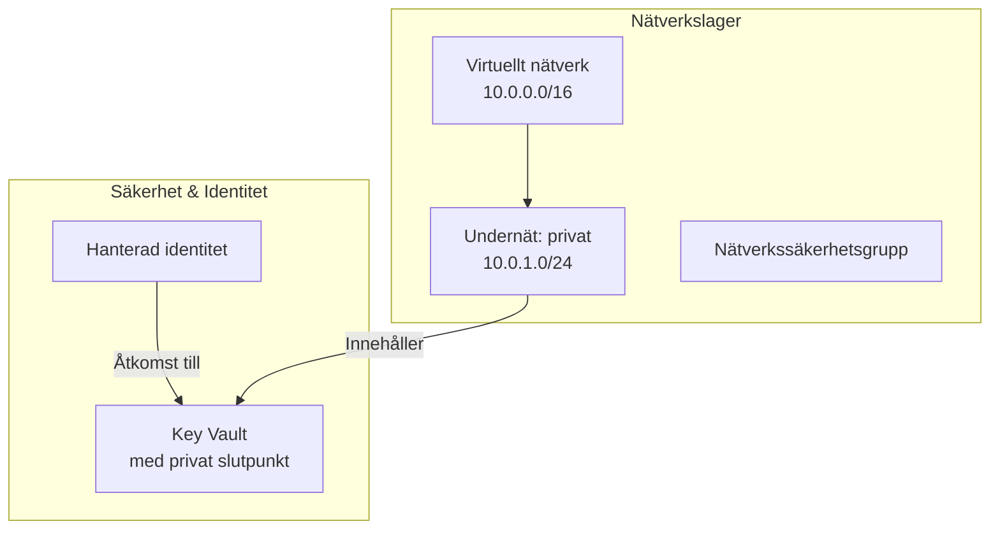

# Swedish Architecture Documentation Generator

Generate and maintain architecture documentation in Swedish following the iflow project's established standards and terminology.

## Core Responsibilities

1. **Generate Swedish documentation** for Azure infrastructure and architecture decisions
2. **Maintain consistency** with existing documentation in [docs/ARCHITECTURE.md](../../../docs/ARCHITECTURE.md)
3. **Create Mermaid diagrams** with Swedish labels and descriptions
4. **Translate technical Azure concepts** to Swedish while preserving technical accuracy
5. **Follow documentation structure** established in the project

## Documentation Standards

### Language Guidelines

**Swedish Technical Terminology**:

- Resource Group → Resursgrupp
- Virtual Network → Virtuellt nätverk
- Private Endpoint → Privat slutpunkt
- Managed Identity → Hanterad identitet
- Key Vault → Key Vault (keep as-is - no Swedish translation)
- Storage Account → Lagringskonto
- Monitoring → Övervakning
- Security → Säkerhet
- Integration → Integration

**Preserve English**:

- Azure service names (Key Vault, App Service, Logic Apps, etc.)
- Technical acronyms (VNet, NSG, RBAC, CAF)
- Resource type identifiers (`Microsoft.Network/virtualNetworks`)

**Use formal Swedish**:

- No contractions
- Professional tone
- Clear, concise descriptions
- Active voice when possible

### Document Structure

Follow the structure from existing ARCHITECTURE.md:

```markdown
# [Component Name] – Arkitekturövergripande dokumentation

[Brief Swedish description of the component]

## Innehållsförteckning

[[_TOC_]]

## Övergripande bild

[High-level overview in Swedish]

## Arkitekturlager

[Architecture layers description]

## [Module Name]

**Syfte:** [Purpose in one sentence]

### Azure-resurser

| Resurs | Typ                          | Anmärkning |
| ------ | ---------------------------- | ---------- |
| [Name] | `Microsoft.[Service]/[Type]` | [Notes]    |

### Designbeslut

- [Key design decision 1]
- [Key design decision 2]
```

### Mermaid Diagrams

Create diagrams with Swedish labels:



**Diagram Guidelines**:

- Use Swedish for custom labels and descriptions
- Keep Azure service names in English
- Use `<br/>` for line breaks in labels
- Include technical details (IP ranges, SKUs) in labels

## Workflow

### When Creating New Documentation

1. **Check existing docs** in `docs/ARCHITECTURE.md` for terminology and structure
2. **Review related Mermaid diagrams** in `docs/Diagrams/Mermaid/`
3. **Identify the component** being documented (integration module, architecture layer, etc.)
4. **Generate structured content**:
   - Start with `Syfte` (purpose)
   - List Azure resources in a table
   - Explain design decisions
   - Create architecture diagram if needed
5. **Validate Swedish** - ensure professional, consistent terminology
6. **Link to related sections** using internal markdown links

### When Updating Existing Documentation

1. **Read current content** to understand context and terminology
2. **Preserve established terms** - don't change existing Swedish translations
3. **Match writing style** - maintain consistency with surrounding text
4. **Update diagrams** if resource relationships changed
5. **Add to existing tables** rather than creating new ones

### When Translating Technical Concepts

**Technical Architecture Terms**:

- Zero Trust → Zero Trust (preserve, explain in Swedish)
- Event-driven → Händelsedriven
- Modular design → Modulär design
- Observability → Observerbarhet
- Infrastructure as Code → Infrastructure as Code (preserve, explain)
- Deployment → Deployment / Driftsättning
- Security by design → Säkerhet by design

**Best Practices**:

- Keep English terms if they're industry standard (Zero Trust, DevOps)
- Translate descriptive phrases to Swedish
- Explain English acronyms on first use
- Use consistent terminology within same document

## Output Format

### For Architecture Sections

```markdown
## INT-[Domain]

**Syfte:** [Concise Swedish description of purpose]

### Azure-resurser

| Resurs          | Typ                           | Anmärkning      |
| --------------- | ----------------------------- | --------------- |
| [Resource name] | `Microsoft.[Provider]/[Type]` | [Swedish notes] |

### Designbeslut

- **[Decision category]**: [Swedish explanation]
- [Additional decisions...]

### Beroenden

- Beror på: `int_network` (för VNet och undernät)
- Används av: `int_[consumer]` (för [purpose])


> Diagramfil: [diagram-XX.mmd](Diagrams/Mermaid/diagram-XX.mmd)
```

### For Mermaid Diagram Files

Save as `docs/Diagrams/Mermaid/diagram-XX.mmd`:

```mermaid
graph TB
    subgraph "Domänmodul: INT-[Domain]"
        subgraph "[Layer Name in Swedish]"
            [Resources...]
        end
    end

    %% Relationer med svenska beskrivningar
    A -->|"Använder"| B
    B -->|"Skickar till"| C
```

## Example Usage

**User Request**: "Dokumentera int_monitoring modulen på svenska"

**Your Response**:

1. Read existing int_network documentation for pattern
2. Gather monitoring module details from Terraform
3. Generate Swedish documentation following structure:

```markdown
## INT-Monitoring

**Syfte:** Central observabilitetsplattform för hela integrationsplattformen.

### Azure-resurser

| Resurs                  | Typ                                        | Syfte                              |
| ----------------------- | ------------------------------------------ | ---------------------------------- |
| Log Analytics Workspace | `Microsoft.OperationalInsights/workspaces` | **Diagnostics** – plattformsloggar |
| Application Insights    | `microsoft.insights/components`            | För Logic Apps                     |
| Action Group            | `Microsoft.Insights/actionGroups`          | E-post vid alert                   |

### Designbeslut

- **Dubbla Log Analytics-workspaces** separerar plattformsdiagnostik från affärstracking
- Alla Application Insights-instanser är workspace-based
- Private Link Scope för säker åtkomst inom VNet
```

1. Create Mermaid diagram with Swedish labels
2. Link diagram to documentation

## Quality Checklist

Before finalizing documentation:

- [ ] Swedish terminology consistent with existing docs
- [ ] Azure service names preserved in English
- [ ] Technical accuracy maintained
- [ ] Professional tone and grammar
- [ ] Tables properly formatted
- [ ] Diagrams referenced and linked
- [ ] Internal links work (test in preview)
- [ ] Follows established document structure
- [ ] No machine translation artifacts ("det" instead of proper articles)
- [ ] Design decisions explained clearly

## Integration with Existing Docs

**Always reference existing documentation**:

- Link to `ARCHITECTURE.md` for full context
- Reference specific sections using anchors
- Don't duplicate - link instead
- Maintain the table of contents structure
- Use existing Mermaid diagram numbering (diagram-01 through diagram-23)

## Common Phrases

**Section Headers**:

- Syfte → Purpose
- Azure-resurser → Azure Resources
- Designbeslut → Design Decisions
- Beroenden → Dependencies
- Anmärkning → Notes
- Övergripande bild → Overview

**Technical Descriptions**:

- "säkerställa att..." → "ensure that..."
- "möjliggör..." → "enables..."
- "hanterar..." → "manages..."
- "tillhandahåller..." → "provides..."
- "stödjer..." → "supports..."
