# IFlow – Arkitekturövergripande dokumentation

IFlow är en integrationsplattform byggd för att stödja robusta, skalbara och säkra integrationsflöden mellan interna och externa system. Arkitekturen är uppdelad i tydliga domänmoduler som kan utvecklas, deployas och förvaltas oberoende, samtidigt som de samverkar genom gemensamma plattformstjänster för nätverk, identitet, meddelandehantering, observabilitet och datalagring.

Lösningen är utformad enligt etablerade best practice-principer för modern molnarkitektur:
- **Security by design** med stark identitetsstyrning, least privilege och centraliserad hemlighetshantering.
- **Zero Trust** där trafik, identitet och åtkomst verifieras explicit och resurser isoleras via privata nätverksgränssnitt.
- **Modulär och event-driven design** för låg koppling, hög förändringstakt och återanvändbara integrationsmönster.
- **Observability-first** med konsekvent spårbarhet, korrelation, larm och diagnostik genom hela flödeskedjan.
- **Infrastructure as Code och standardiserad deployment** för reproducerbarhet, versionsstyrning och säker drift över miljöer.

Dokumentet beskriver både den övergripande målarkitekturen och de tekniska implementationerna i respektive modul, inklusive säkerhetsmodell, driftmodell, beroenden och end-to-end-flöden.

---

## Innehållsförteckning

Innehållsförteckning i Azure DevOps Wiki:

[[_TOC_]]

Kortversion för styrgrupp och wiki-översikt: [ARCHITECTURE-EXECUTIVE.md](ARCHITECTURE-EXECUTIVE.md)

## Publicering i Azure DevOps Wiki

Publicera dokumentationen med följande upplägg:

1. [ARCHITECTURE.md](ARCHITECTURE.md) som huvudsida för fullständig teknisk arkitekturbeskrivning.
2. [ARCHITECTURE-EXECUTIVE.md](ARCHITECTURE-EXECUTIVE.md) som kortversion för styrgrupp och beslutsunderlag.
3. Behåll [Diagrams/Mermaid](Diagrams/Mermaid) bredvid markdownfilerna så att diagram och fallback-bilder fortsätter fungera i wikin.

---

## 1. Övergripande bild

**IFlow** är en Azure-baserad integrationsplattform uppbyggd som en modulär, event-driven arkitektur. Den hanterar affärsintegrationer via API Management som gateway, Logic Apps Standard för orkestrering och Azure Functions (.NET Isolated) för teknisk processering och tracking.

Plattformen är säkerhetsmässigt funderad på:
- **Zero-trust nätverk** – alla resurser kommunicerar via Private Endpoints inuti ett VNet.
- **Managed Identity** – ingen connection string lagras i kod; all autentisering sker via RBAC.
- **Azure Key Vault** – samtliga hemligheter centraliserade med auditlogg.

Modulerna är designade för att kunna deployas oberoende av varandra och delar gemensamma resurser (nätverk, Key Vault, messaging) via parametrisering.

---

## 2. Arkitekturlager

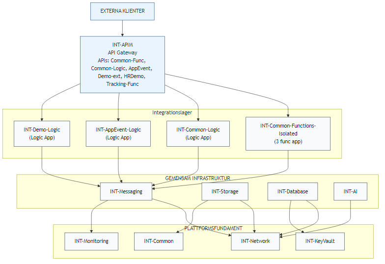

> Diagramfil: [diagram-20.mmd](Diagrams/Mermaid/diagram-20.mmd)

---

## 3. INT-Network

**Syfte:** Definierar hela nätverkstopologin som alla andra moduler är beroende av.

### Azure-resurser

| Resurs | Typ | Anmärkning |
|---|---|---|
| VNet | `Microsoft.Network/virtualNetworks` | Centralt VNet med 8 subnät |
| NSG | `Microsoft.Network/networkSecurityGroups` | Associerad med alla subnät |
| Private DNS Zones | `Microsoft.Network/privateDnsZones` | 15 zoner (se nedan) |
| Private Link Scope | `Microsoft.Insights/privateLinkScopes` | För Monitor/Log Analytics |
| NAT Gateway | `Microsoft.Network/natGateways` | Kommenterad – valfri |
| Public IP | `Microsoft.Network/publicIPAddresses` | Kommenterad – valfri |

### Subnät

| Subnät | Syfte |
|---|---|
| `privateendpoint` | Private Endpoints för alla PaaS-resurser |
| `logicapp` | VNet-integrering för Logic Apps |
| `functionapp` | VNet-integrering för Function Apps |
| `subnet_4` – `subnet_8` | Reserverade (namnges via parametrar) |

### Private DNS Zoner

Samtliga 15 Private Link DNS-zoner skapas i VNetet för att säkerställa att DNS-upplösning av PaaS-resurser alltid pekar på privata IP-adresser:

- `privatelink.azure-api.net` (APIM)
- `privatelink.servicebus.windows.net` (Service Bus)
- `privatelink.eventgrid.azure.net` (Event Grid)
- `privatelink.azurewebsites.net` (App Service / Logic Apps / Function Apps)
- `privatelink.blob/table/queue/file.core.windows.net` (Storage)
- `privatelink.vaultcore.azure.net` (Key Vault)
- `privatelink.monitor.azure.com` / `oms/ods/agentsvc` (Monitor)
- `privatelink.applicationinsights.azure.com`
- `privatelink.database.windows.net` (SQL)

---

## 4. INT-Monitoring

**Syfte:** Central observabilitetsplattform för hela integrationsplattformen.

### Azure-resurser

| Resurs | Typ | Namn/Syfte |
|---|---|---|
| Log Analytics Workspace | `Microsoft.OperationalInsights/workspaces` | **Diagnostics** – plattformsloggar |
| Log Analytics Workspace | `Microsoft.OperationalInsights/workspaces` | **Tracking** – affärshändelser & spårning |
| Application Insights | `microsoft.insights/components` | För Logic Apps |
| Application Insights | `microsoft.insights/components` | För Function Apps |
| Application Insights | `microsoft.insights/components` | För APIM |
| Action Group | `Microsoft.Insights/actionGroups` | E-post vid alert (environment-named) |
| Private Link Scope (Monitor) | `Microsoft.Insights/privateLinkScopes` | Ansluter LA & AppInsights till VNet |
| Private Link Scope (AppInsights) | `Microsoft.Insights/privateLinkScopes` | Ansluter AI till VNet |
| Managed Identity Role Assignment | RBAC | Monitoring Contributor för UAI |

### Designbeslut

- **Dubbla Log Analytics-workspaces** separerar plattformsdiagnostik från affärstracking, vilket möjliggör separat hantering av retention och åtkomst.
- Alla Application Insights-instanser är kopplade till Diagnostics Log Analytics (workspace-based).
- Alert Action Groups namnges med environment-suffix (`DEV`, `TEST`, `PROD`).

---

## 5. INT-Common

**Syfte:** Gemensamma infrastrukturresurser som delas av alla integrationer.

### Azure-resurser

| Resurs | Typ | Syfte |
|---|---|---|
| User Assigned Managed Identity (UAI) | `Microsoft.ManagedIdentity/userAssignedIdentities` | Delad identitet för alla integrationer |
| App Service Plan (Logic Apps) | `Microsoft.Web/serverfarms` | Elastic Premium för Logic Apps Standard |
| App Service Plan (Function Apps) | `Microsoft.Web/serverfarms` | Elastic Premium för Azure Functions |
| App Service Plan (Web Apps) | `Microsoft.Web/serverfarms` | Standard/Premium för webb-applikationer |
| Key Vault Access | RBAC | UAI ges Key Vault-access |
| Subscription Access | RBAC | UAI ges subscription-scope access |

### Designbeslut

- Den User Assigned Managed Identity är **den enda centrala identiteten** i plattformen.  
  Samtliga Logic Apps, Function Apps och APIM refererar till denna för gemensam autentisering.
- Service Plans är delade för att minimera kostnad och förenkla skalning.

---

## 6. INT-KeyVault

**Syfte:** Central hemlighetshantering med privat nätverksåtkomst.

### Azure-resurser

| Resurs | Typ |
|---|---|
| Key Vault | `Microsoft.KeyVault/vaults` |
| Private Endpoint | `Microsoft.Network/privateEndpoints` |
| DNS Zone Group | Kopplar PE till `privatelink.vaultcore.azure.net` |
| Key Vault Access Policy | RBAC per modul |

### Designbeslut

- Soft-delete aktiverat med konfigurerbart antal dagar.
- Åtkomst ges per modul vid deployment (Logic Apps, Function Apps, APIM ges egna access policies).
- Hemligheter som refereras: `IntegrationsDB-Username`, `IntegrationsDB-Password`, `FunctionAppHostKey`.

---

## 7. INT-Messaging

**Syfte:** Event-driven meddelandeinfrastruktur för integrationsplattformen.

### Azure-resurser

| Resurs | Typ | Anmärkning |
|---|---|---|
| Service Bus Namespace (Logging) | `Microsoft.ServiceBus/namespaces` | Standard, zone-redundant, TLS 1.2 |
| Service Bus Namespace (Message Broker) | `Microsoft.ServiceBus/namespaces` | Standard, zone-redundant, Auth: IntegrationAccess |
| Event Hub Namespace | `Microsoft.EventHub/namespaces` | Standard, Kafka-enabled, zone-redundant |
| Event Hub: `workflowruntimelogs` | `Microsoft.EventHub/namespaces/eventhubs` | Logic App workflow runtime-loggar |

### Service Bus-köer (Message Broker)

| Kö | Syfte |
|---|---|
| `errortracking` | Felmeddelanden för spårning |
| `keyvaluetracking` | Key/value-data för spårning |
| `messagecontenttracking` | Meddelandeinnehåll för spårning |
| `freetexttracking` | Fritext för spårning |
| `messageflowtracking` | Meddelandeflöde för spårning |
| `filearchivetracking` | Filarkivering för spårning |

### Access Control

Vid deployment tilldelas User Assigned Managed Identity RBAC-roller på:
- Event Hub Namespace (send/receive)
- Logging Service Bus (send/receive)
- Message Broker Service Bus (send/receive)

---

## 8. INT-Storage

**Syfte:** Centraliserat storage-lager med privat åtkomst och rollbaserad access.

### Storage Accounts

| Storage Account | Syfte | Private Endpoint-typ |
|---|---|---|
| Archive | Arkivering av meddelandeinnehåll | Blob |
| Schema | XML/JSON-schemalagring | Blob |
| Monitoring | Monitoringsdata | Table |
| Large Message | Stora meddelanden (Claim-Check pattern) | Blob |
| Logic App | Logic Apps runtime state | Blob + File |
| Function App | Function Apps host state | Blob + File |
| AI | Azure AI Foundry storage | Blob |

### Designbeslut

- Samtliga Storage Accounts exponeras uteslutande via Private Endpoints.
- UAI tilldelas `Storage Blob Data Contributor`-roll via RBAC (ingen connection string används).
- Separata SA per syfte möjliggör granulär åtkomststyrning och lifecycle policies.

---

## 9. INT-Database

**Syfte:** Persistent lagring för integrationstillstånd och affärsdata.

### Azure-resurser

| Resurs | Typ |
|---|---|
| Azure SQL Server | `Microsoft.Sql/servers` |
| SQL Database (Integrations) | `Microsoft.Sql/servers/databases` |
| Private Endpoint | `Microsoft.Network/privateEndpoints` |

### Designbeslut

- Administratörs-credentials hämtas vid deployment från Key Vault (`IntegrationsDB-Username`, `IntegrationsDB-Password`).
- Azure AD-autentisering konfigureras via `sqlAdminSid` (service principal/grupp).
- SQL-SKU (name, tier, family) parametriseras för att möjliggöra skalning per environment.
- Private Endpoint kopplar SQL till `privatelink.database.windows.net`-zonen.

---

## 10. INT-AuthConnectors

**Syfte:** Azure API-anslutningar (connections) för Logic Apps.

### Connectors

| Connector | Resurstyp | Syfte |
|---|---|---|
| Office 365 Mail | `Microsoft.Web/connections` | Skicka e-post från Logic Apps |
| Microsoft Teams | `Microsoft.Web/connections` | Skicka Teams-meddelanden |
| MSN Weather | `Microsoft.Web/connections` | Väderdata (demo) |

### Designbeslut

- Connectors deployeras i ett **separat resource group** (`authConnectionsResourceGroup`).
- Logic Apps autentiseras mot connectors via `LogicAppAuthAccessPolicy` som skapas av respektive Logic App-modul.
- Runtime URL:er för connectors skickas som parametrar till Logic App-modulerna.

---

## 11. INT-APIM

**Syfte:** API Gateway – enda ingressmöjligheten till integrationsplattformen för externa klienter.

### Infrastructure-komponenter

| Resurs | Typ |
|---|---|
| API Management Service | `Microsoft.ApiManagement/service` |
| System Assigned Identity | Skapas automatiskt av APIM |
| User Assigned Identity | Refererar INT-Common UAI |
| Key Vault Access Policy | APIM system identity → Key Vault |
| Private Endpoint (APIM) | `privatelink.azure-api.net` |
| Private Link Scope | Kopplar APIM Application Insights till VNet |
| Metric Alerts (4xx/5xx) | `microsoft.insights/metricAlerts` |

### APIM-konfiguration

- **SKU**: Parametriserat (Standard/Developer/Consumption)
- **Custom Domains**: Developer Portal, Management, Proxy, SCM (via Key Vault-certifikat)
- **Backend-autentisering**: SAS-signatures injekteras som Named Values via Key Vault-references

### Exponerade APIs

| API | Backend | Workflow/Endpoint |
|---|---|---|
| **Common-Logic** | INT-Common-Logic (Logic App) | `mail-sender` |
| **Common-Func** | INT-Common-Functions (Function App) | HTTP-triggers |
| **AppEvent** | INT-AppEvent-Logic (Logic App) | `SetObjectEventStatus` |
| **Demo-ext** | INT-Demo-Logic (Logic App) | `Demo-SchemaValidator`, `Demo-Session-Convoy-Receiver`, `Demo-Session-LongRunning-Initiator`, `Demo-Session-LongRunning-Response` |
| **HRDemo** | INT-Demo-HR (API App) | REST API |
| **Tracking-Func** | INT-Common-Functions Tracking App | HTTP-triggers |

### APIM Products & Subscriptions

- **LogicApp Product** – med policy (rate limiting m.m.)
- **Named Values** – refererar Key Vault för säker konfiguration
- Subscriptions deployeras separat via `INT.APIM.Subscriptions.bicep`

---

## 12. INT-Common-Functions-Isolated

**Syfte:** Gemensamma Azure Functions (.NET Isolated) för plattformsövergripande tjänster.

### Function Apps

| Function App | Syfte |
|---|---|
| **Common** | Generella hjälpfunktioner, schema-validering m.m. |
| **Tracking** | Konsumerar tracking-köer från Service Bus och persisterar till SQL/Storage |
| **Logger** | Centraliserad loggning |

### Infrastruktur per Function App

- Eget Storage Account (Blob + File)
- Private Endpoint (App Service DNS-zon)
- VNet-integration via `functionAppSubnet`
- Application Insights (Diagnostics workspace)
- System Assigned Identity + User Assigned Identity
- Key Vault Key Reference (host keys)

### Integrationspunkter

| Service | Åtkomst |
|---|---|
| Service Bus (Message Broker) | RBAC (System Assigned Identity) |
| Event Hub | RBAC (User Assigned Identity) |
| SQL Server (Integrations DB) | Connection string via Key Vault |
| Storage (Archive, Schema, Monitoring) | RBAC via System Assigned Identity |
| APIM | Backend-registrering med host key |

### Tracking-köer (Service Bus → Tracking Function App)

`messageflow`, `messagecontent`, `keyvalue`, `filearchive`, `freetext`, `error`

### 12.1 Detaljerad operationsöversikt (INT-Common-Functions-Isolated)

Nedan listas samtliga identifierade operationer i kodbasen under `INT-Common-Functions-Isolated/Src`, grupperat per Function App.

#### Common Function App (HTTP + timer)

| Operation | Trigger | Input (huvudparametrar) | Gör detta |
|---|---|---|---|
| `GetTopicSubscriptionDeadLetterSummary` | HTTP POST | `topic?`, `subscription?` | Hämtar dead-letter summering per topic/subscription i Message Broker-namnrymden. |
| `GetQueueDeadLetterSummary` | HTTP POST | `queue?` | Hämtar dead-letter summering för köer i Logging/Common Service Bus. |
| `GetTopicDeadLetterMessagesPeek` | HTTP POST | `topic`, `subscription`, `maxCount?` | Peeka flera dead-letter meddelanden (utan lock/complete). |
| `GetTopicDeadLetterMessagePeek` | HTTP POST | `topic`, `subscription`, `sequenceNumber` | Peeka ett specifikt dead-letter meddelande via sequence number. |
| `GetTopicDeadLetterMessagePeekLock` | HTTP POST | `topic`, `subscription`, `sequenceNumber` | Hämtar ett dead-letter meddelande med peek-lock för efterföljande disposition. |
| `CompleteTopicDeadLetterMessage` | HTTP POST | `topic`, `subscription`, `sequenceNumber` | Completar (tar bort) ett dead-letter meddelande på topic subscription. |
| `GetTopicSubscriptionDeferredMessagesPeek` | HTTP POST | `topic`, `subscription` | Listar deferred meddelanden för topic subscription. |
| `GetTopicSubscriptionDeferredMessagePeek` | HTTP POST | `topic`, `subscription`, `sequenceNumber` | Hämtar ett deferred meddelande; returnerar egen statuskod vid "MessageNotFound". |
| `CompleteTopicDeferredMessage` | HTTP POST | `topic`, `subscription`, `sequenceNumber` | Completar ett deferred meddelande. |
| `DeadLetterTopicDeferredMessage` | HTTP POST | `topic`, `subscription`, `sequenceNumber`, `deadLetterReason` | Dead-letterar ett deferred meddelande med angiven orsak. |
| `AbandonTopicDeferredMessage` | HTTP POST | `topic`, `subscription`, `sequenceNumber` | Abandonerar ett deferred meddelande så det blir tillgängligt igen. |
| `GetQueueDeadLetterMessagesPeek` | HTTP POST | `queue`, `maxCount?` | Peeka flera dead-letter meddelanden i kö. |
| `GetQueueDeadLetterMessagePeek` | HTTP POST | `queue`, `sequenceNumber` | Peeka ett specifikt dead-letter meddelande i kö. |
| `GetQueueDeadLetterMessagePeekLock` | HTTP POST | `queue`, `sequenceNumber` | Hämtar ett kö-dead-letter med peek-lock. |
| `CompleteQueueDeadLetterMessage` | HTTP POST | `queue`, `sequenceNumber` | Completar ett dead-letter meddelande i kö. |
| `CheckTopicSubscriptionNewerMessageExists` | HTTP POST | `topic`, `subscription`, `identity`, `sequenceNumber` | Kontrollerar om nyare meddelande finns för samma identitet än ett visst sequence number. |
| `DeadLetterTimerTracker` | Timer (`0 0 1 * * *`) | - | Nattlig sammanställning av dead-letter läge (topics + köer) till Log Analytics. |
| `PDFMerge` | HTTP POST | Body: lista med base64-PDF | Slår ihop flera PDF-dokument till en PDF och returnerar base64. |
| `CSV_To_JSON` | HTTP POST | Query: `delimiter`, Body: CSV | Konverterar CSV-rader till JSON-objektlista utifrån header-raden. |
| `FileArchiver` | HTTP POST | Query: `targetprefix?`, `targetcontainer?`, Body: fil-lista | Skriver text/base64-filer till blob-storage för arkivering. |
| `RemoveSpecialCharacters` | HTTP POST | `stringToClean`, `specialCharactersRegExp` | Rensar bort tecken via regex och returnerar städad sträng. |

#### Tracking Function App (HTTP ingress för tracking + validering)

| Operation | Trigger | Input (huvudparametrar) | Gör detta |
|---|---|---|---|
| `LogicAppInitiatorTracker` | HTTP POST | `resourceGroup`, `logicApp`, `workflow`, `runId`, `interchangeId`, `messageId?`, `callerId?`, `timestamp` | Skapar MessageFlow-trackingpost och skickar till `messageflowtracking`-kön. |
| `LogicAppMessageTracker` | HTTP POST | Samma metadata + body med `TrackedMessage[]` | Skapar en MessageContentTracker per meddelande med innehåll och skickar till `messagecontenttracking`. |
| `LogicAppKeyValueTracker` | HTTP POST | Samma metadata + body med `TrackedKeyValue[]` | Skickar key/value-spårning till `keyvaluetracking`. |
| `LogicAppFreeTextTracker` | HTTP POST | Samma metadata + body med `string[]` | Skickar fritextspårning till `freetexttracking`. |
| `LogicAppErrorTracker` | HTTP POST | Samma metadata | Skickar felspårning till `errortracking` (metadata om körning/felkontext). |
| `JsonSchemaValidator` | HTTP POST | Body med schemafil + meddelande | Hämtar JSON-schema från blob (`schemas`-container), validerar payload, returnerar `422` vid valideringsfel. |
| `SwaggerSchemaValidator` | HTTP POST | Body med swaggerfil + schemanamn + meddelande | Hämtar OpenAPI/Swagger från blob, validerar mot specifik komponent-schema, returnerar `422` vid valideringsfel. |

#### Logger Function App (asynkrona konsumenter)

| Operation | Trigger | Input (huvudparametrar) | Gör detta |
|---|---|---|---|
| `MessageFlowLogger` | Service Bus Trigger (`%MessageFlowTrackingQueue%`) | `MessageFlowTracker` | Skriver flödestracking till Log Analytics-tabell `MessageFlowTracker`. |
| `MessageContentLogger` | Service Bus Trigger (`%MessageContentTrackingQueue%`) | `MessageContentTracker` | Läser konfigurerade tracking paths från Table Storage och loggar extraherade värden till `MessageContentTracker`. |
| `KeyValueLogger` | Service Bus Trigger (`%KeyValueTrackingQueue%`) | `KeyValueTracker` | Skriver key/value-tracking till Log Analytics. |
| `FileArchiveLogger` | Service Bus Trigger (`%FileArchiveTrackingQueue%`) | `FileArchiveTracker` | Skriver filarkiv-tracking till Log Analytics. |
| `FreeTextLogger` | Service Bus Trigger (`%FreeTextTrackingQueue%`) | `FreeTextTracker` | Skriver fritext-tracking till Log Analytics. |
| `ErrorLogger` | Service Bus Trigger (`%ErrorTrackingQueue%`) | `ErrorTracker` | Hämtar detaljer om Logic App-run via Azure Management API, extraherar failed actions och loggar berikat felobjekt till `ErrorTracker`. |
| `EventHubLogger` | Event Hub Trigger (`workflowruntimelogs`, consumer group `workflowlogs`) | Event Hub-event | Tolkar `WorkflowRunStarted`/`WorkflowRunCompleted` records och loggar `WorkflowRunTracker` till Log Analytics. |

### 12.2 Operationella mönster och ansvar

- **Synchronous API-verktyg (Common):** HTTP-operationer för dead-letter/deferred hantering, formatkonvertering och arkivering.
- **Tracking ingress (Tracking):** standardiserade HTTP-endpoints som Logic Apps anropar för korrelerad spårning.
- **Asynchronous loggning (Logger):** kö- och eventdrivna konsumenter som transformerar och skriver till Log Analytics.
- **Felberikning:** `ErrorLogger` gör runtime-uppslag av Logic App action-fel och kompletterar tracking med detaljfel.

### 12.3 Flödesdiagram: från Logic App till observabilitet

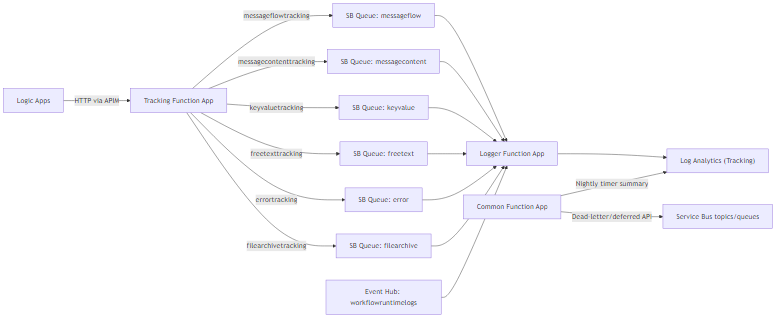

> Diagramfil: [diagram-21.mmd](Diagrams/Mermaid/diagram-21.mmd)

### 12.4 Sekvensdiagram: deferred och dead-letter-hantering

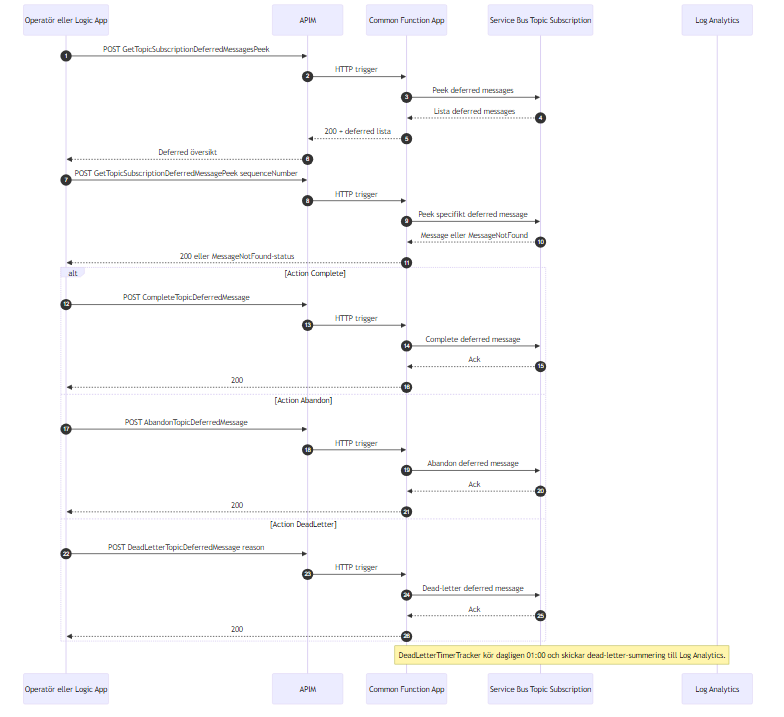

> Diagramfil: [diagram-18.mmd](Diagrams/Mermaid/diagram-18.mmd)

### 12.5 Viktiga operationella tolkningar för deferred/dead-letter

- `Peek`-operationer är läsande och används för operativ analys utan att konsumera meddelandet.
- `PeekLock`-operationer används när nästa steg ska kunna disponera meddelandet (complete eller annan disposition).
- `Complete` tar permanent bort meddelandet från dead-letter/deferred-flödet.
- `Abandon` släpper lås så meddelandet kan hanteras igen.
- `DeadLetter` flyttar deferred meddelande till dead-letter med explicit orsak för spårbarhet.

### 12.6 Sekvensdiagram: queue dead-letter-hantering

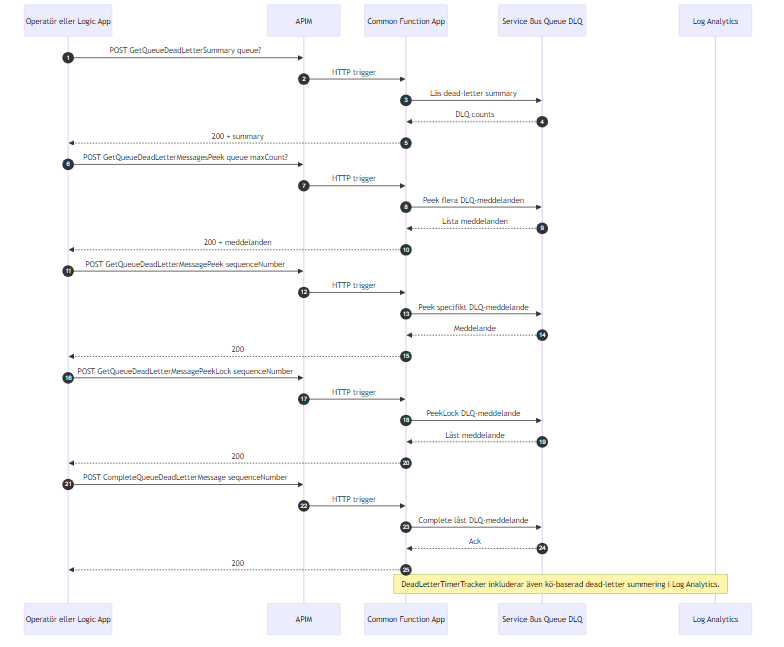

> Diagramfil: [diagram-19.mmd](Diagrams/Mermaid/diagram-19.mmd)

#### När används vilken queue-operation?

| Situation | Rekommenderad operation | Effekt |
|---|---|---|
| Snabb hälsokoll av DLQ-läge per kö | `GetQueueDeadLetterSummary` | Returnerar aggregerad volym/status för prioritering. |
| Behöver se flera meddelanden för triage | `GetQueueDeadLetterMessagesPeek` | Läser ett urval utan att påverka meddelandestatus. |
| Behöver analysera ett specifikt meddelande | `GetQueueDeadLetterMessagePeek` | Hämtar enstaka meddelande via `sequenceNumber`. |
| Ska åtgärda ett meddelande och säkra exklusiv hantering | `GetQueueDeadLetterMessagePeekLock` | Låser meddelandet tillfälligt för kontrollerad disposition. |
| Meddelandet är verifierat och kan rensas från DLQ | `CompleteQueueDeadLetterMessage` | Tar permanent bort det låsta DLQ-meddelandet. |

### 12.7 Viktiga implementationstekniska observationer

- Nästan alla HTTP-operationer använder `AuthorizationLevel.Function` och förväntas frontas via APIM.
- Samtliga tre Function Apps kör .NET Isolated med Application Insights Worker Service konfigurerad i respektive `Program.cs`.
- `Route = null` används på HTTP triggers, vilket innebär standardroute per funktionsnamn.
- Valideringsfunktionerna returnerar domänmässigt korrekt `422 Unprocessable Entity` vid schemafel.
- Dead-letter/deferred-operationerna i Common fungerar som ett operativt verktygslager för driftsättning och felsökning av integrationsflöden.

---

## 13. INT-Common-Logic

**Syfte:** Gemensam Logic App Standard för plattformstjänster – skickar e-post, hanterar notifieringar.

### Infrastruktur

| Resurs | Typ |
|---|---|
| Logic App Standard | `Microsoft.Web/sites` (kind: functionapp,workflowapp) |
| Storage Account | Blob (runtime state) |
| Private Endpoint | `privatelink.azurewebsites.net` |
| Key Vault Access | System Assigned Identity |
| Service Bus Access | RBAC (Message Broker) |
| Auth Connector Access Policy | Office 365 Mail |

### Exponerade workflows (via APIM)

- `mail-sender` – tar emot anrop via APIM och skickar e-post via Office 365

### Konfiguration

- Event Hub Authorization Rule injekteras som app-inställning
- APIM-namn och resource group injekteras för direktkommunikation
- Delar App Service Plan med övriga Logic Apps

---

## 14. INT-AppEvent-Logic

**Syfte:** Hanterar affärshändelse-integrationer (Application Events / objektstatusuppdateringar).

### Infrastruktur

Identisk struktur med INT-Common-Logic plus:

| Extra resurs | Syfte |
|---|---|
| SQL Server access | Läser/skriver affärstillstånd |
| Service Bus Monitoring Alerts | Dead letter-alerts per kö |
| Logic App Monitoring Alerts | 4xx/5xx-alerts |

### Exponerade workflows (via APIM)

- `SetObjectEventStatus` – tar emot objektstatushändelser och orchestrerar vidare bearbetning

### App-inställningar

- `applicationLogRetentionDays` – konfigurerbar loggretention  
- `objectEventRetentionDays` – konfigurerbar retention för affärsobjekt

---

## 15. INT-Demo-Logic

**Syfte:** Demo-integrationer som visar plattformens kapaciteter, inklusive AI- och session management-mönster.

### Infrastruktur

Identisk med INT-Common-Logic plus:

| Extra resurs | Syfte |
|---|---|
| Teams Connector | Skickar Teams-meddelanden |
| MSN Weather Connector | Väderdata för demo |
| AI Foundry-integration | Anropar Azure AI Foundry (LLM) |

### Exponerade workflows (via APIM Demo-ext API)

| Workflow | Mönster |
|---|---|
| `Demo-SchemaValidator` | Request/Response – validerar meddelande mot JSON/XML-schema |
| `Demo-Session-Convoy-Receiver` | Session-based convoy pattern – tar emot i ordning |
| `Demo-Session-LongRunning-Initiator` | Async long-running – startar ett jobb |
| `Demo-Session-LongRunning-Response` | Async long-running – svarar på poll/callback |

---

## 16. INT-AI

**Syfte:** AI/ML-kapaciteter integrerade i plattformen.

### Azure-resurser

| Resurs | Typ | Konfiguration |
|---|---|---|
| AI Foundry (AIServices) | `Microsoft.CognitiveServices/accounts` | S0, `allowProjectManagement: true` |
| AI Foundry Project: IFlow | `Microsoft.CognitiveServices/accounts/projects` | Default projekt |
| AI Foundry Deployments | Model deployments | Konfigureras i `AI.Foundry.Deployments.bicep` |
| Azure AI Search | `Microsoft.Search/searchServices` | Free tier, publik åtkomst |
| Storage Account (AI) | `Microsoft.Storage/storageAccounts` | Blob, privat PE |
| Private Endpoints | PE för Foundry | `foundryPrivateEndpointDnsZone` |

### Designbeslut

- AI Foundry deployeras med System Assigned Identity.
- User Assigned Identity ges åtkomst till Foundry-resursen.
- AI Search är i free tier (kan uppgraderas via parametrar).
- Foundry integreras direkt med INT-Demo-Logic via app-inställning.

---

## 17. INT-Demo Och INT-Demo-HR

**Syfte:** Kompletta demo-applikationer som visar end-to-end integrationsflöden med HR-data.

### INT-Demo-HR

| Resurs | Typ | Syfte |
|---|---|---|
| API App | `Microsoft.Web/sites` | ASP.NET REST API mot HR-data |
| Web App | `Microsoft.Web/sites` | Frontend mot HR API |
| SQL Server + HR Demo DB | `Microsoft.Sql/servers` | HR-data |
| App Service Plan | `Microsoft.Web/serverfarms` | Delad plan för webb-appar |

### INT-Demo

| Resurs | Typ | Syfte |
|---|---|---|
| Logic App | `Microsoft.Web/sites` (workflowapp) | Orkestrering av demo-flöden |
| API App | `Microsoft.Web/sites` | REST API |
| Web App | `Microsoft.Web/sites` | Frontend |
| SQL Server | `Microsoft.Sql/servers` | HR Demo-databas (delar med INT-Demo-HR) |
| Service Bus Connector | Connection String | Direct Service Bus-integration |

### APIM-exponering (HRDemo API)

- Backend pekar mot `INT-Demo-HR API App`
- Named Values konfigureras
- Policy: Rate limiting, autentisering

---

## 18. IFlow-Portal

**Syfte:** Administrations- och övervakningsportal för IFlow-plattformen.

### Azure-resurser

| Resurs | Typ |
|---|---|
| API App | `Microsoft.Web/sites` (ASP.NET) |
| App Service Plan | `Microsoft.Web/serverfarms` |
| Log Analytics Workspace | `Microsoft.OperationalInsights/workspaces` |
| Application Insights | `microsoft.insights/components` |
| SQL Server + IFlow Portal DB | `Microsoft.Sql/servers/databases` |

### Designbeslut

- Portalen har **sin egen Log Analytics och Application Insights**, separerat från INT-Monitoring.
- Portalen läser tracking-data från INT-Monitoring:s Tracking Log Analytics Workspace.
- SQL-databas för portalens metadata (konfiguration, jobhistorik etc.).
- Fristående Bicep-lösning (`IFlow.Portal.sln`) med eget CI/CD-pipeline.

---

## 19. Säkerhetsmodell

### Identitet & Åtkomst

```
┌─────────────────────────────────────────────────────────┐
│             User Assigned Managed Identity (UAI)         │
│                     (INT-Common)                         │
│                                                         │
│  Åtkomst till:                                          │
│  • Key Vault (Get Secrets)                              │
│  • Storage Accounts (Blob Data Contributor)             │
│  • Service Bus (Data Owner)                             │
│  • Event Hub (Data Owner)                               │
│  • APIM (Referenced as user identity)                   │
│  • AI Foundry                                           │
│  • Subscription RBAC (för cross-RG operationer)         │
└─────────────────────────────────────────────────────────┘

Varje Logic App & Function App har dessutom System Assigned Identity
för Key Vault- och Service Bus-åtkomst specifik för sin funktion.
```

### Nätverkssäkerhet

- **Alla PaaS-resurser** kommunicerar via Private Endpoints – ingen direkt internettrafik tillåts.
- **VNet-integrering** aktiverat för Logic Apps och Function Apps.
- **NSG** appliceras på samtliga subnät.
- APIM är den **enda publika ingångspunkten** (Custom domains via Azure Front Door konvention).
- Private DNS Zones säkerställer korrekt namn-upplösning utan offentligt DNS.

### Mönster: hemligheter

```
Key Vault
  ├── IntegrationsDB-Username     → INT-Database deployment
  ├── IntegrationsDB-Password     → INT-Database deployment  
  └── FunctionAppHostKey          → INT-Common-Functions deployment
                                    & APIM Named Values
```

---

## 20. Observabilitetsstrategi

### Tre dimensioner av observabilitet

| Dimension | Workspace | Innehåll |
|---|---|---|
| **Plattformsdiagnostik** | Log Analytics (Diagnostics) | Azure-resursloggar, APIM-loggar, Service Bus-loggar |
| **Affärstracking** | Log Analytics (Tracking) | Meddelandeflödesdata, tracking-events, affärstillstånd |
| **APM / Distributed Tracing** | Application Insights (x3) | End-to-end traces för Logic Apps / Functions / APIM |

### Alert-strategi

| Komponent | Alert-typ | Tröskelvärde | Kanal |
|---|---|---|---|
| APIM | HTTP 4xx | > 1 per 15 min | E-post (Action Group) |
| APIM | HTTP 5xx | > 1 per 15 min | E-post (Action Group) |
| Function Apps | HTTP 4xx | > 1 per 30 min | E-post (Action Group) |
| Function Apps | HTTP 5xx | > 1 per 30 min | E-post (Action Group) |
| Logic Apps | Metric alerts | Konfigurerade i monitoring-moduler | E-post (Action Group) |
| Service Bus | Dead Letter | Konfigurerat | E-post (Action Group) |

### Event Hub: Workflow Runtime Logs

Logic Apps-runtime streamas via Event Hub (`workflowruntimelogs`) med consumer group `workflowlogs` för realtids-processering och extern integrering.

---

## 21. Arkitekturdiagram Mermaid

### Diagramlegend

Fargkodning som anvands i Mermaid-diagrammen:

- **Bla**: Klient/kanal
- **Gron**: API/ingress
- **Orange**: Workflow/orkestrering
- **Lila**: Messaging (Service Bus/Event Hub)
- **Gra**: Data/lagring
- **Rosa**: AI-komponenter
- **Gul**: Beslutspunkt

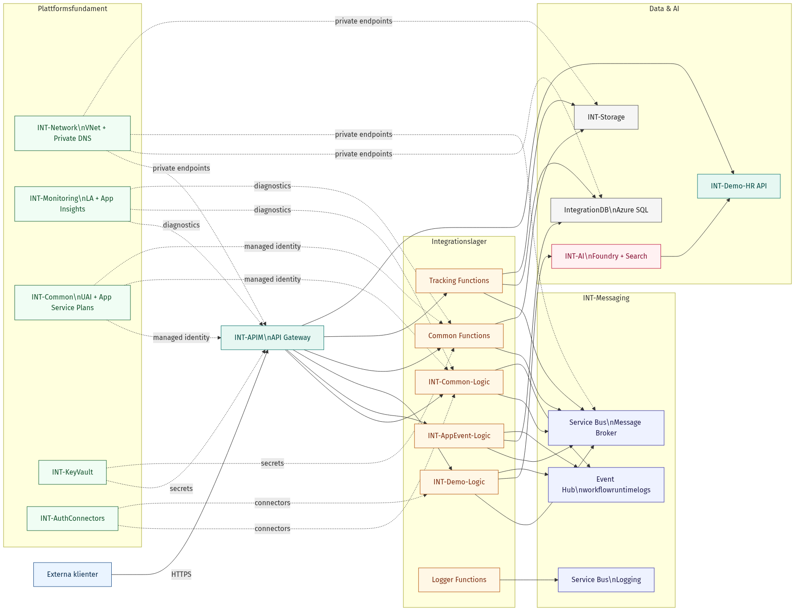

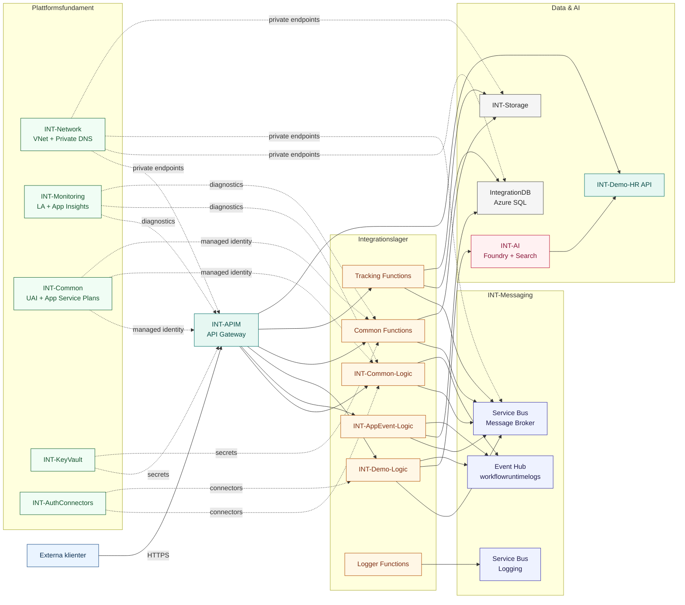
```mermaid
flowchart LR
    EXT["Externa klienter"] -->|HTTPS| APIM["INT-APIM\nAPI Gateway"]

    subgraph APP["Integrationslager"]
        direction TB
        LA1["INT-Common-Logic"]
        LA2["INT-AppEvent-Logic"]
        LA3["INT-Demo-Logic"]
        F1["Common Functions"]
        F2["Tracking Functions"]
        F3["Logger Functions"]
    end

    subgraph MSG["INT-Messaging"]
        SB1["Service Bus\nMessage Broker"]
        SB2["Service Bus\nLogging"]
        EH["Event Hub\nworkflowruntimelogs"]
    end

    subgraph DATA["Data & AI"]
        SQL["IntegrationDB\nAzure SQL"]
        ST["INT-Storage"]
        AIF["INT-AI\nFoundry + Search"]
        HR["INT-Demo-HR API"]
    end

    subgraph FOUNDATION["Plattformsfundament"]
        NW["INT-Network\nVNet + Private DNS"]
        MON["INT-Monitoring\nLA + App Insights"]
        COM["INT-Common\nUAI + App Service Plans"]
        KV["INT-KeyVault"]
        CONN["INT-AuthConnectors"]
    end

    APIM --> LA1
    APIM --> LA2
    APIM --> LA3
    APIM --> F1
    APIM --> F2
    APIM --> HR

    LA1 --> SB1
    LA2 --> SB1
    LA3 --> SB1
    F1 --> SB1
    F2 --> SB1
    F3 --> SB2

    LA2 --> SQL
    F2 --> SQL
    F1 --> ST
    F2 --> ST
    LA3 --> AIF
    AIF --> HR

    LA1 --> EH
    LA2 --> EH
    LA3 --> EH

    NW -. private endpoints .-> APIM
    NW -. private endpoints .-> SQL
    NW -. private endpoints .-> SB1
    NW -. private endpoints .-> ST
    KV -. secrets .-> APIM
    KV -. secrets .-> F1
    MON -. diagnostics .-> APIM
    MON -. diagnostics .-> LA1
    MON -. diagnostics .-> F1
    COM -. managed identity .-> APIM
    COM -. managed identity .-> LA1
    COM -. managed identity .-> F1
    CONN -. connectors .-> LA1
    CONN -. connectors .-> LA3

    classDef client fill:#EAF4FF,stroke:#1D4E89,color:#0B2E4F;
    classDef api fill:#E6F7F2,stroke:#0F766E,color:#074B46;
    classDef workflow fill:#FFF7E6,stroke:#B45309,color:#7C2D12;
    classDef messaging fill:#EEF2FF,stroke:#3730A3,color:#1E1B4B;
    classDef data fill:#F5F5F5,stroke:#525252,color:#262626;
    classDef platform fill:#F0FDF4,stroke:#166534,color:#14532D;
    classDef ai fill:#FFF1F2,stroke:#BE123C,color:#881337;

    class EXT client;
    class APIM,HR api;
    class LA1,LA2,LA3,F1,F2,F3 workflow;
    class SB1,SB2,EH messaging;
    class SQL,ST data;
    class AIF ai;
    class NW,MON,COM,KV,CONN platform;
```

---

## Deployordning och beroenden

Modulerna måste deployas i följande ordning för att beroenden ska vara uppfyllda:

```
1. INT-Network          (inget beroende)
2. INT-Monitoring       (beroende: INT-Network)
3. INT-Common           (inget beroende)
4. INT-KeyVault         (beroende: INT-Network, INT-Common)
5. INT-AuthConnectors   (inget beroende)
6. INT-Messaging        (beroende: INT-Monitoring)
7. INT-Storage          (beroende: INT-Network, INT-Common)
8. INT-Database         (beroende: INT-Network, INT-KeyVault)
9. INT-AI               (beroende: INT-Network, INT-Common)
10. INT-APIM            (beroende: INT-Monitoring, INT-Common, INT-KeyVault, INT-Network)
11. INT-Common-Functions-Isolated  (beroende: 1-10)
12. INT-Common-Logic    (beroende: 1-10)
13. INT-AppEvent-Logic  (beroende: 1-10)
14. INT-Demo-Logic      (beroende: 1-10, INT-AI)
15. INT-Demo / INT-Demo-HR  (beroende: 1-13)
16. INT-APIM APIs       (beroende: 10-15, Logic Apps & Functions måste finnas)
17. INT-APIM Subscriptions  (beroende: INT-APIM + APIs)
18. IFlow-Portal        (fristående parallell med 1-10)
```

---

## 22. Service Bus Topologi

Meddelandeinfrastrukturen består av **två separata Service Bus-namnrymder**, med tydligt separerade ansvar.

### 22.1 Logging Service Bus (Standard-nivå)

Används exklusivt av **Tracking Function App** för att ta emot spårnings- och loggningsdata. Alla köer är enkla FIFO-köer utan sessioner.

| Kö | Syfte | TTL | Dubblettdetektering |
|---|---|---|---|
| `errortracking` | Felrapporter från Logic Apps | 14 dagar | Nej |
| `keyvaluetracking` | Nyckel/värde-par för spårning | 14 dagar | Nej |
| `messagecontenttracking` | Meddelandeinnehåll för spårning | 14 dagar | Nej |
| `freetexttracking` | Fritextlogg | 14 dagar | Nej |
| `messageflowtracking` | Meddelandeflöden (dubblettskyddad) | 14 dagar | Ja (1 timme) |
| `filearchivetracking` | Filarkivering | 14 dagar | Nej |

### 22.2 Message Broker Service Bus (Standard-nivå)

Används för att **distribuera affärsmeddelanden** mellan Logic Apps via publish/subscribe-mönstret. Alla meddelandetyper implementeras som topics med subscriptioner och SQL-filter för routing.

#### Topics och subscriptions

**Topic: `DeferredMessages`**  
Hanterar livscykeln för uppskjutna (deferred) meddelanden – kompletta, abandonera eller dead-lettera ett previousally deferrat meddelande.

| Subscription | SQL-filter | Konsument |
|---|---|---|
| `DeferredMessages-Complete` | `ObjectType='DeferredMessage' AND Action='Complete'` | DeferredMessageComplete (INT-Common-Logic) |
| `DeferredMessages-Abandon` | `ObjectType='DeferredMessage' AND Action='Abandon'` | DeferredMessageAbandon (INT-Common-Logic) |
| `DeferredMessages-DeadLetter` | `ObjectType='DeferredMessage' AND Action='DeadLetter'` | DeferredMessageDeadLetter (INT-Common-Logic) |

---

**Topic: `EventNotification`**  
Distribuerar affärshändelser (ObjectEvents) från AppEvent-motorn till integrationsflöden baserat på systemkälla och objekttyp.

| Subscription | SQL-filter | Konsument |
|---|---|---|
| `EventNotification-Demo-HR-Employee` | `objectType='Employee' AND sendingSystem='HRDemo'` | Demo-HR-GetEmployeeChanges (INT-Demo-Logic) |
| `EventNotification-Unknown` | `ObjectType='Unknown'` | Dead-letter / catch-all |

---

**Topic: `Demo-Employee`**  
Distribuerar kanoniska meddelanden om anställda till flera mottagarsystem (fan-out).

| Subscription | SQL-filter | Konsument |
|---|---|---|
| `Demo-Employee-Subscriber1` | `ObjectType='Employee'` | Demo-HR-EmployeeSubscriber1 (INT-Demo-Logic) – alla länder |
| `Demo-Employee-Subscriber2` | `ObjectType='Employee' AND CountryCode='SE'` | Demo-HR-EmployeeSubscriber2 (INT-Demo-Logic) – Sverige |

---

**Topic: `Demo-Deferred`**  
Hanterar batch-meddelanden som ska uppskjutas och processeras i grupp.

| Subscription | SQL-filter | Konsument |
|---|---|---|
| `Demo-Deferred-Handler` | `ObjectType='Demo-Deferred'` | Demo-DeferredMessagesHandler (INT-Demo-Logic) |

---

**Topic: `Demo-Single-Deferred`**  
Hanterar enstaka uppskjutna meddelanden.

| Subscription | SQL-filter | Konsument |
|---|---|---|
| `Demo-Single-Deferred-Handler` | `ObjectType='Demo-Single-Deferred'` | Demo-SingleDeferredMessageHandler (INT-Demo-Logic) |

---

**Topic: `Demo-Session-LongRunning`** *(session-enabled)*  
Koordinerar asynkrona, långvariga operationer via Service Bus-sessioner. SessionId = `customerId`.

| Subscription | SQL-filter | Konsument |
|---|---|---|
| `Demo-Session-LongRunning-Handler` | `1=1` (alla meddelanden) | Demo-Session-LongRunning-Handler (INT-Demo-Logic) |

---

**Topic: `Demo-Session-Convoy`** *(session-enabled)*  
Samlar flera relaterade meddelanden (order-rader) för en och samma transaktion via sessionsmönstret. SessionId = `Session-{customerId}`.

| Subscription | SQL-filter | Konsument |
|---|---|---|
| `Demo-Session-Convoy-Handler` | `1=1` (alla meddelanden) | Demo-Session-Convoy-Handler (INT-Demo-Logic) |

---

## 23. Tvärgående korrelation, tracking och felhantering

Alla Logic App-workflows implementerar ett enhetligt mönster för korrelation, spårning och felhantering.

### 23.1 Korrelationsobjektet

Varje meddelande bär ett JSON-objekt `CorrelationId` i meddelanderubriken eller `correlationId`-fältet:

```json
{
  "InterchangeId": "<workflow-run-id>",
  "MessageId": "<guid>",
  "CallerId": "<anropande-workflow-run-id>"
}
```

- **InterchangeId** – identifierar hela utbytet (en körning eller ett interchange-ID)  
- **MessageId** – identifierar ett enskilt meddelande  
- **CallerId** – spårar vem som initierade anropet (för anropskedjenavigering)

### 23.2 Tracking via APIM/Tracking Function

Alla workflows anropar Tracking Function App via APIM vid varje steg:

| Endpoint | När | Syfte |
|---|---|---|
| `/tracking-func/LogicAppInitiatorTracker` | I början av Try-blocket | Spårar att workflow startat |
| `/tracking-func/LogicAppMessageTracker` | I Finally-blocket | Spårar meddelandeinnehåll och typ |
| `/tracking-func/LogicAppErrorTracker` | I Catch-blocket | Spårar fel och felmeddelanden |
| `/tracking-func/JsonSchemaValidator` | Vid schema-validering | Validerar inkommande meddelanden |

Alla anrop sker med **Managed Service Identity** mot APIM:s audience.

### 23.3 Try/Catch/Finally-mönstret

Varje workflow använder ett standardiserat scope-baserat mönster:

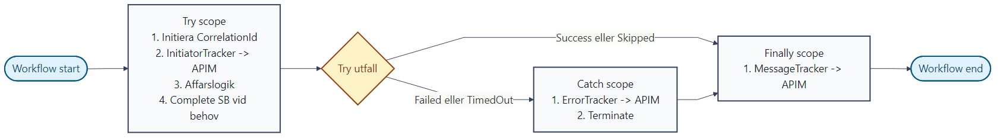

> Diagramfil: [diagram-23.mmd](Diagrams/Mermaid/diagram-23.mmd)

### 23.4 Läsguide för sekvensdiagram

- **Executive vy** visar affärsflödet på hög nivå utan intern implementation.
- **Teknisk vy** visar vilka workflows, topics, API:er och datalager som deltar tekniskt.
- `->>` betyder anrop eller meddelande till nästa part.
- `-->>` betyder svar, kvittens eller leverans tillbaka.
- `loop` markerar upprepad behandling.
- `alt` markerar alternativa vägar, till exempel godkänd respektive underkänd hantering.

---

## 24. End-to-end-flöde: AppEvent händelsedriven integration

AppEvent-motorn är en generisk, konfigurationsdriven mekanism för att detektera förändringar i källsystem och distribuera dem som händelser till prenumeranter.

### 24.E Executive vy (Mermaid)

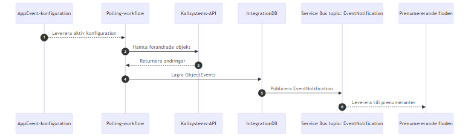

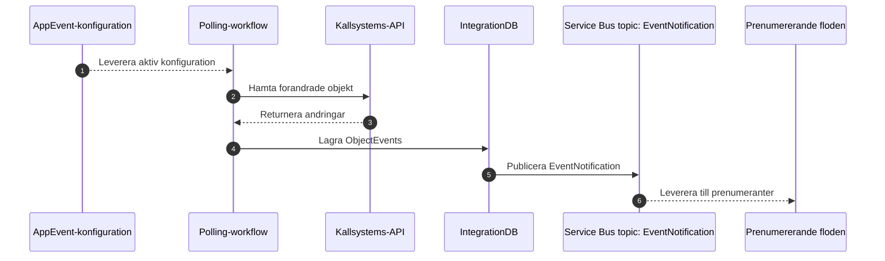
```mermaid
sequenceDiagram
    autonumber
    participant CFG as AppEvent-konfiguration
    participant POLL as Polling-workflow
    participant API as Kallsystems-API
    participant DB as IntegrationDB
    participant TOP as Service Bus topic: EventNotification
    participant SUB as Prenumererande floden

    CFG-->>POLL: Leverera aktiv konfiguration
    POLL->>API: Hamta forandrade objekt
    API-->>POLL: Returnera andringar
    POLL->>DB: Lagra ObjectEvents
    DB->>TOP: Publicera EventNotification
    TOP-->>SUB: Leverera till prenumeranter
```

### 24.0 Teknisk vy (Mermaid)

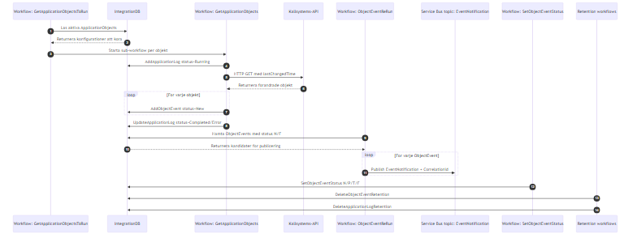

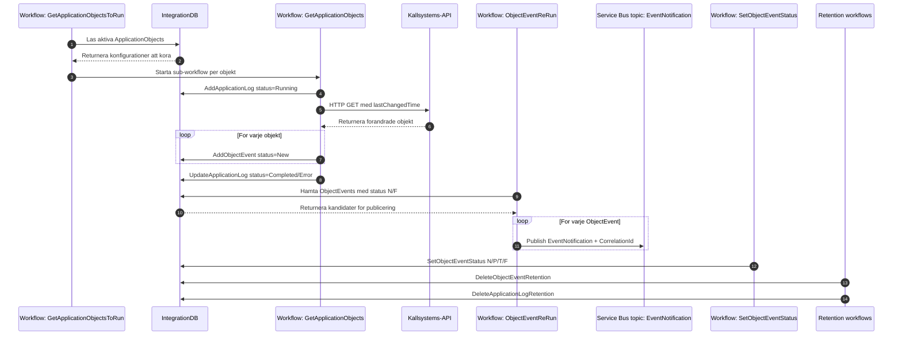
```mermaid
sequenceDiagram
    autonumber
    participant POLL as Workflow: GetApplicationObjectsToRun
    participant DB as IntegrationDB
    participant FETCH as Workflow: GetApplicationObjects
    participant API as Kallsystems-API
    participant REPUB as Workflow: ObjectEventReRun
    participant TOP as Service Bus topic: EventNotification
    participant STATUS as Workflow: SetObjectEventStatus
    participant RET as Retention workflows

    POLL->>DB: Las aktiva ApplicationObjects
    DB-->>POLL: Returnera konfigurationer att kora
    POLL->>FETCH: Starta sub-workflow per objekt
    FETCH->>DB: AddApplicationLog status=Running
    FETCH->>API: HTTP GET med lastChangedTime
    API-->>FETCH: Returnera forandrade objekt
    loop For varje objekt
        FETCH->>DB: AddObjectEvent status=New
    end
    FETCH->>DB: UpdateApplicationLog status=Completed/Error
    REPUB->>DB: Hamta ObjectEvents med status N/F
    DB-->>REPUB: Returnera kandidater for publicering
    loop For varje ObjectEvent
        REPUB->>TOP: Publish EventNotification + CorrelationId
    end
    STATUS->>DB: SetObjectEventStatus N/P/T/F
    RET->>DB: DeleteObjectEventRetention
    RET->>DB: DeleteApplicationLogRetention
```

### 24.1 Arkitekturella komponenter

```
SQL (IntegrationDB) ← AppEvent-schema (SPs och tabeller)
Logic App (AppEvent) ← Polling-trigger + workflow-kedja
Service Bus (MessageBroker) → Topic: EventNotification
```

### 24.2 Steg-för-steg

```
STEG 1 – Polling (var 1:a minut)
GetApplicationObjectsToRun (Recurrence)
│
├─ SP: AppEvent.GetApplicationObjectsToRun
│    Returnerar alla ApplicationObjects med aktiva konfigurationer
│
├─ Om inga poster: Terminate (Cancelled)
│
└─ Invoke sub-workflow: GetApplicationObjects (SplitOn per ApplicationObject)

STEG 2 – Hämta och lagra händelser (per ApplicationObject)
GetApplicationObjects (HTTP-triggrad av GetApplicationObjectsToRun)
│
├─ SP: AppEvent.AddApplicationLog (status: R = Running)
├─ Hämta senast körda tidpunkt och bygg fråge-URL
├─ HTTP GET → {APIMBaseURI}/{ObjectQuery}?lastChangedTime=...
│    (anropar källsystemets API via APIM med MSI-auth)
│
├─ För varje objekt i svaret:
│    ├─ InvokeFunction: Map_ObjectEvents_To_EventNotifications
│    └─ SP: AppEvent.AddObjectEvent (lagrar händelse med status N=New)
│
└─ SP: AppEvent.UpdateApplicationLog (status: C/E = Completed/Error)

STEG 3 – Distribuera händelser (var 1:a minut)
ObjectEventReRun (Recurrence)
│
├─ SP: AppEvent.GetObjectEventReRun
│    Returnerar alla ObjectEvents med status N (New) eller F (Failed)
│
└─ För varje ObjectEvent:
     ├─ InvokeFunction: Map_DB_ObjectEvent_To_EventNotification
     └─ Send → Service Bus topic: eventnotification
          UserProperties: { Action, ObjectEvent, ObjectType, SendingSystem }
          CorrelationId: { InterchangeId, MessageId, CallerId }

STEG 4 – Uppdatera status
SetObjectEventStatus (HTTP-triggrad via APIM /appevent/setobjecteventstatus)
│
└─ SP: AppEvent.SetObjectEventStatus(ObjectEventId, Status)
     Status: N=New, P=Processing, T=Transferred, F=Failed

STEG 5 – Underhåll (dagligen)
DeleteObjectEventRetention (dagligen kl 02:00)
│  └─ SP: AppEvent.DeleteObjectEventRetention(RetentionDays)

DeleteApplicationLogRetention (dagligen kl 01:00)
   └─ SP: AppEvent.DeleteApplicationLogRetention(RetentionDays)
```

### 24.3 Konfigurationsdriven design

AppEvent-motorn är generisk – varje källsystem registreras i databasen (`ApplicationObject`-tabellen) med:
- REST-fråge-URL med `<LastChangedTime>`-placeholder
- Mappnings-funktion (InvokeFunction i Logic App)
- Prenumerationsfilter (ObjectType + SendingSystem)

---

## 25. End-to-end-flöde: HR Employee kanoniskt meddelande

Detta flöde visar hela kedjan från AppEvent-detektion till leverans i målformat hos flera mottagare.

### 25.E Executive vy (Mermaid)

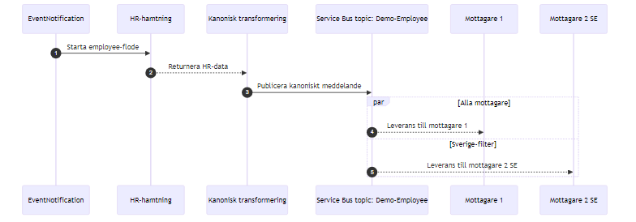

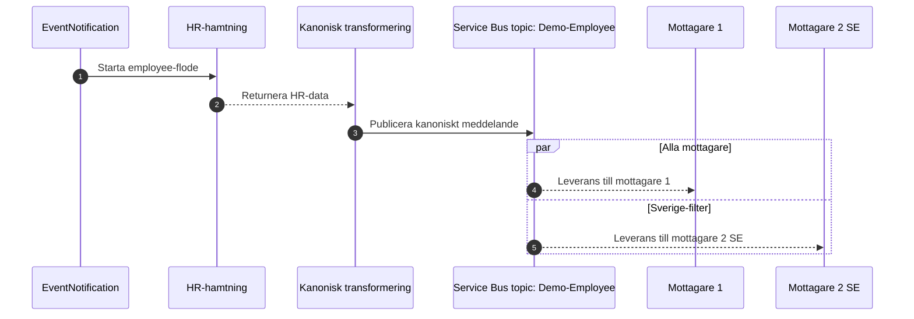
```mermaid
sequenceDiagram
    autonumber
    participant EVT as EventNotification
    participant FETCH as HR-hamtning
    participant MAP as Kanonisk transformering
    participant TOP as Service Bus topic: Demo-Employee
    participant SUB1 as Mottagare 1
    participant SUB2 as Mottagare 2 SE

    EVT->>FETCH: Starta employee-flode
    FETCH-->>MAP: Returnera HR-data
    MAP->>TOP: Publicera kanoniskt meddelande
    par Alla mottagare
        TOP-->>SUB1: Leverans till mottagare 1
    and Sverige-filter
        TOP-->>SUB2: Leverans till mottagare 2 SE
    end
```

### 25.0 Teknisk vy (Mermaid)

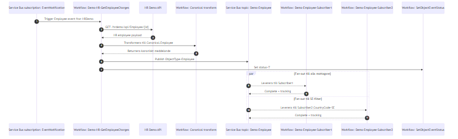

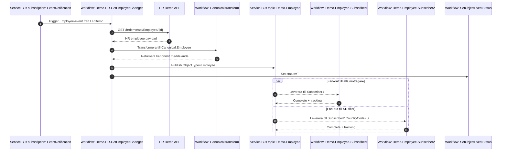
```mermaid
sequenceDiagram
    autonumber
    participant EVT as Service Bus subscription: EventNotification
    participant GET as Workflow: Demo-HR-GetEmployeeChanges
    participant API as HR Demo API
    participant MAP as Workflow: Canonical transform
    participant TOP as Service Bus topic: Demo-Employee
    participant SUB1 as Workflow: Demo-Employee-Subscriber1
    participant SUB2 as Workflow: Demo-Employee-Subscriber2
    participant STATUS as Workflow: SetObjectEventStatus

    EVT->>GET: Trigger Employee-event fran HRDemo
    GET->>API: GET /hrdemo/api/Employee/{id}
    API-->>GET: HR employee payload
    GET->>MAP: Transformera till Canonical.Employee
    MAP-->>GET: Returnera kanoniskt meddelande
    GET->>TOP: Publish ObjectType=Employee
    GET->>STATUS: Set status=T
    par Fan-out till alla mottagare
        TOP-->>SUB1: Leverera till Subscriber1
        SUB1-->>TOP: Complete + tracking
    and Fan-out till SE-filter
        TOP-->>SUB2: Leverera till Subscriber2 CountryCode=SE
        SUB2-->>TOP: Complete + tracking
    end
```

### 25.1 Flödeskarta

```
HRDemo-system (källa)
        │
        │ (pollas av AppEvent-motorn var 1:a minut)
        ▼
IntegrationDB: AppEvent.ObjectEvent (status=N, objectType=Employee, sendingSystem=HRDemo)
        │
        │ ObjectEventReRun distribuerar
        ▼
Service Bus: eventnotification (topic)
  SQL-filter: objectType='Employee' AND sendingSystem='HRDemo'
        │
        ▼ Subscription: EventNotification-Demo-HR-Employee
Demo-HR-GetEmployeeChanges (INT-Demo-Logic)
        │
        ├─ 1. LogicAppInitiatorTracker
        ├─ 2. HTTP GET {APIMBaseURI}/hrdemo/api/Employee/{objectId_1}
        │       → Hämtar anställd från HR Demo API
        ├─ 3. InvokeFunction: HR_Demo_Employee_To_Canonical_Employee
        │       → Transformerar till kanoniskt format (Canonical.Employee)
        ├─ 4. Send → SB topic: demo-employee
        │       UserProperties: { ObjectType='Employee', SendingSystem, CountryCode }
        ├─ 5. Complete SB-meddelande (eventnotification/EventNotification-Demo-HR-Employee)
        └─ 6. HTTP POST /appevent/setobjecteventstatus {ObjectEventId, Status='T'}
                → Markerar händelsen som levererad

        Service Bus: demo-employee (topic) – FAN-OUT
        │
        ├─ Subscription: Demo-Employee-Subscriber1
        │    Filter: ObjectType='Employee' (ALLA länder)
        │    │
        │    ▼
        │  Demo-HR-EmployeeSubscriber1 (INT-Demo-Logic)
        │    ├─ InvokeFunction: Canonical_Employee_To_Subscriber1_Employee
        │    ├─ Affärslogik (t.ex. uppdatera Subscriber1-system)
        │    ├─ Complete SB-meddelande
        │    └─ LogicAppMessageTracker (messageType: Subscriber1.Employee)
        │
        └─ Subscription: Demo-Employee-Subscriber2
             Filter: ObjectType='Employee' AND CountryCode='SE' (ENDAST Sverige)
             │
             ▼
           Demo-HR-EmployeeSubscriber2 (INT-Demo-Logic)
             ├─ Transformerar till Subscriber2-format (svenska fältnamn):
             │    AnstNr, Fornamn, Efternamn, Telefon, Epost, Landskod, Avdelning
             ├─ Complete SB-meddelande
             └─ LogicAppMessageTracker (messageType: Subscriber2.Employee)
```

### 25.2 Kanonisk datamodell

Mönstret implementerar en **kanonisk datamodell** – källsystemets format transformeras till ett neutralt format (Canonical.Employee) och varje mottagare transformerar från kanonisk form till sitt eget format. På så sätt behöver inte källsystems-logiken känna till mottagarnas format.

```
HRDemo-format  →  [HR_Demo_Employee_To_Canonical]  →  Canonical.Employee
Canonical.Employee  →  [Canonical_Employee_To_Subscriber1]  →  Subscriber1.Employee
Canonical.Employee  →  [Canonical_Employee_To_Subscriber2]  →  Subscriber2.Employee (svenska fält)
```

---

## 26. End-to-end-flöde: Deferred Message-mönstret

Deferred Message-mönstret används för att ta emot ett stort antal meddelanden och bearbeta dem som en kontrollerad batch. Meddelanden "uppskjuts" (defers) i köen – de förblir i kön men raderas inte förrän systemet aktivt kompletterar dem.

### 26.E Executive vy (Mermaid)

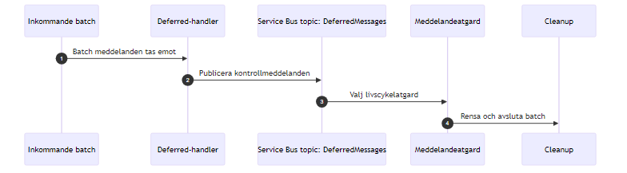

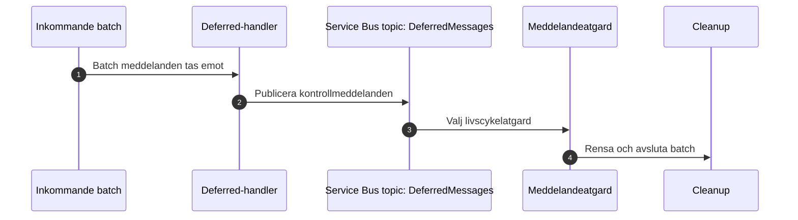
```mermaid
sequenceDiagram
    autonumber
    participant IN as Inkommande batch
    participant DEF as Deferred-handler
    participant CTRL as Service Bus topic: DeferredMessages
    participant ACT as Meddelandeatgard
    participant CLEAN as Cleanup

    IN->>DEF: Batch meddelanden tas emot
    DEF->>CTRL: Publicera kontrollmeddelanden
    CTRL->>ACT: Valj livscykelatgard
    ACT->>CLEAN: Rensa och avsluta batch
```

### 26.0 Teknisk vy (Mermaid)

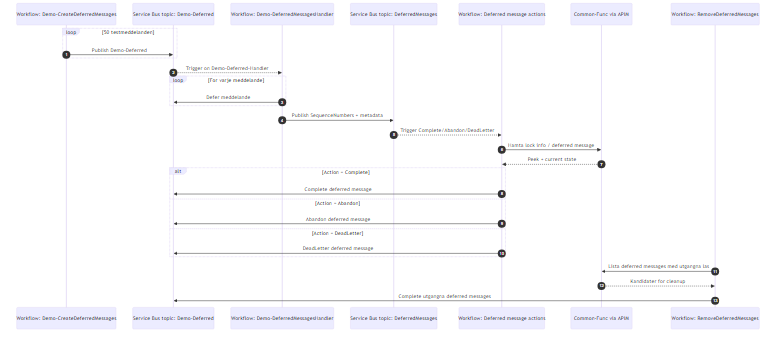

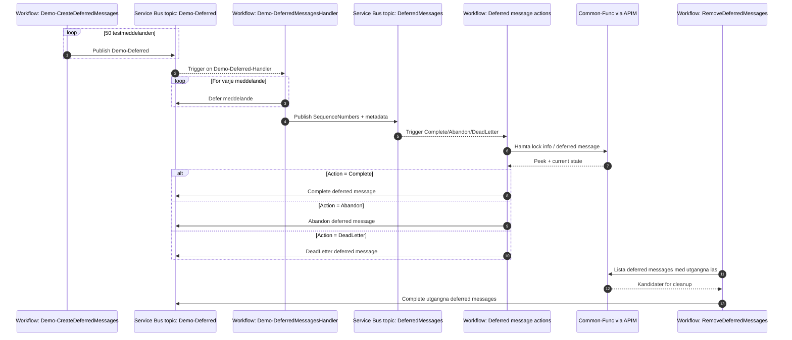
```mermaid
sequenceDiagram
    autonumber
    participant CR as Workflow: Demo-CreateDeferredMessages
    participant DEMO as Service Bus topic: Demo-Deferred
    participant HANDLER as Workflow: Demo-DeferredMessagesHandler
    participant CTRL as Service Bus topic: DeferredMessages
    participant ACT as Workflow: Deferred message actions
    participant CF as Common-Func via APIM
    participant CLEAN as Workflow: RemoveDeferredMessages

    loop 50 testmeddelanden
        CR->>DEMO: Publish Demo-Deferred
    end
    DEMO-->>HANDLER: Trigger on Demo-Deferred-Handler
    loop For varje meddelande
        HANDLER->>DEMO: Defer meddelande
    end
    HANDLER->>CTRL: Publish SequenceNumbers + metadata
    CTRL-->>ACT: Trigger Complete/Abandon/DeadLetter
    ACT->>CF: Hamta lock info / deferred message
    CF-->>ACT: Peek + current state
    alt Action = Complete
        ACT->>DEMO: Complete deferred message
    else Action = Abandon
        ACT->>DEMO: Abandon deferred message
    else Action = DeadLetter
        ACT->>DEMO: DeadLetter deferred message
    end
    CLEAN->>CF: Lista deferred messages med utgangna las
    CF-->>CLEAN: Kandidater for cleanup
    CLEAN->>DEMO: Complete utgangna deferred messages
```

### 26.1 Flödeskarta (batch-deferred)

```
STEG 1 – Skapa testdata (demo)
Demo-CreateDeferredMessages (HTTP-triggrad)
│
└─ Loopar 50 gånger:
     Send → SB topic: demo-deferred
       contentData: { companyId, batchId, article, orderId, ... }
       UserProperties: { ObjectType='Demo-Deferred' }

        Service Bus: demo-deferred (topic)
        Subscription: Demo-Deferred-Handler
                │
                ▼
STEG 2 – Ta emot och skjut upp
Demo-DeferredMessagesHandler (SB-triggrad)
│
├─ Peek-lock meddelanden (max 100 åt gången, upp till 300 totalt)
├─ För varje meddelande:
│    ├─ Defer → SB (meddelandet kvarstår men låses upp)
│    ├─ Spara SequenceNumber + CorrelationId i variabel
│    └─ Bygg AllSequenceNumbers-lista
│
└─ Send → SB topic: deferredmessages
     UserProperties: { ObjectType='DeferredMessage', Action='??' }
     (innefattar SequenceNumber, Topic, Subscription per meddelande)

STEG 3 – Livscykelhantering (INT-Common-Logic)
DeferredMessageComplete (SB-triggrad, filter: Action='Complete')
│
├─ GetTopicSubscriptionDeferredMessagePeek via APIM/Common-Func
│    → Hämtar det uppskjutna meddelandets nuvarande låsinfo
├─ Loop (upp till 10 iterationer, max PT10M):
│    ├─ Om lås har gått ut:
│    │    ├─ Get deferred message from topic subscription
│    │    └─ Complete the deferred message
│    └─ Annars: Renew lock (förnya låset) + Delay 1 minut
└─ LogicAppMessageTracker (messageType: Common.DeferredMessageComplete)

DeferredMessageAbandon (SB-triggrad, filter: Action='Abandon')
│  └─ Samma mönster men Abandon istället för Complete

DeferredMessageDeadLetter (SB-triggrad, filter: Action='DeadLetter')
   └─ Samma mönster men DeadLetter på meddelandet

STEG 4 – Rensa förväntade deferrade meddelanden
RemoveDeferredMessages (HTTP-triggrad, via APIM Common-Logic)
│
├─ GetTopicSubscriptionDeferredMessagesPeek → Common-Func
│    → Lista alla deferrade meddelanden (topic: demo-deferred, subscription: Demo-Deferred-Handler)
└─ För varje meddelande med utgånget lås:
     CompleteTopicDeferredMessage → Common-Func
```

### 26.2 Varför Deferred Messages?

Mönstret löser batch-tratttproblemet: ett system kan skicka 1000-tals meddelanden i ett svep utan att de bearbetas okontrollerat. Mottagaren:
1. Tar emot alla meddelanden snabbt
2. Deferrar dem (de kvarstår i kön utan att konkurrera om processeringstid)
3. Väljer när och hur de bearbetas
4. Kompletterar (raderar) dem explicit när de är klara

---

## 27. End-to-end-flöde: Session LongRunning async request-reply

Session LongRunning implementerar ett **asynkront Request-Reply-mönster** med Service Bus-sessioner. Klienten initierar en operation och väntar på ett svar via sedan-sessionen utan att hålla en öppen HTTP-anslutning.

### 27.E Executive vy (Mermaid)

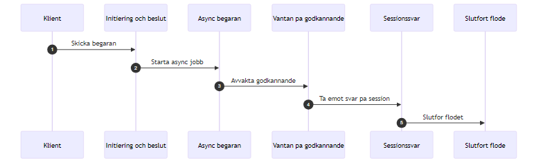

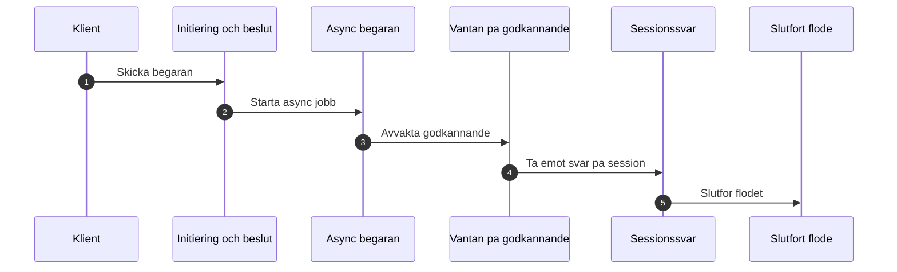
```mermaid
sequenceDiagram
    autonumber
    participant REQ as Klient
    participant GATE as Initiering och beslut
    participant ASYNC as Async begaran
    participant WAIT as Vantan pa godkannande
    participant RESP as Sessionssvar
    participant DONE as Slutfort flode

    REQ->>GATE: Skicka begaran
    GATE->>ASYNC: Starta async jobb
    ASYNC->>WAIT: Avvakta godkannande
    WAIT->>RESP: Ta emot svar pa session
    RESP->>DONE: Slutfor flodet
```

### 27.0 Teknisk vy (Mermaid)

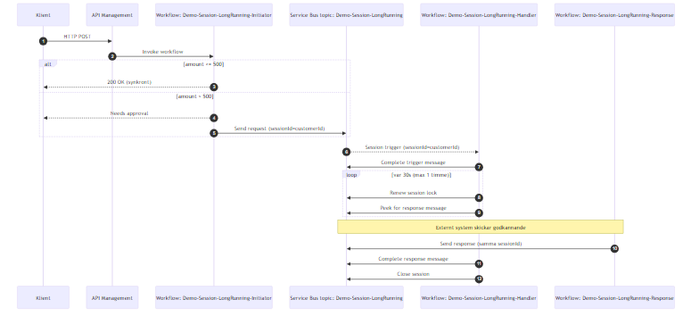

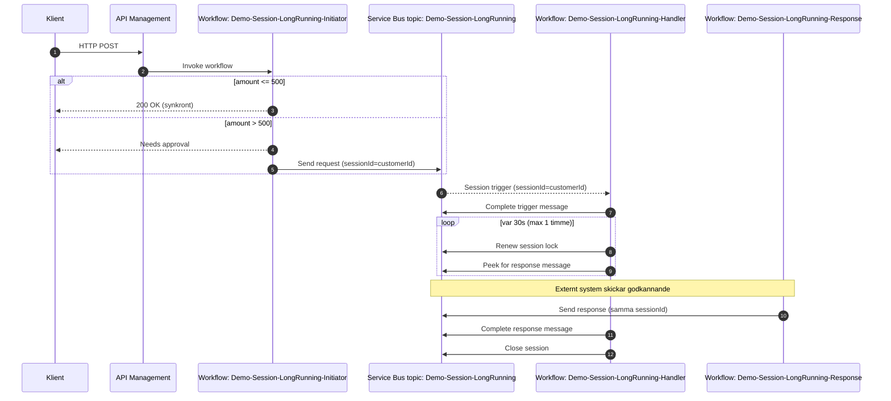
```mermaid
sequenceDiagram
    autonumber
    participant C as Klient
    participant APIM as API Management
    participant INI as Workflow: Demo-Session-LongRunning-Initiator
    participant SB as Service Bus topic: Demo-Session-LongRunning
    participant HND as Workflow: Demo-Session-LongRunning-Handler
    participant RSP as Workflow: Demo-Session-LongRunning-Response

    C->>APIM: HTTP POST
    APIM->>INI: Invoke workflow
    alt amount <= 500
        INI-->>C: 200 OK (synkront)
    else amount > 500
        INI-->>C: Needs approval
        INI->>SB: Send request (sessionId=customerId)
    end

    SB-->>HND: Session trigger (sessionId=customerId)
    HND->>SB: Complete trigger message

    loop var 30s (max 1 timme)
        HND->>SB: Renew session lock
        HND->>SB: Peek for response message
    end

    Note over RSP,SB: Externt system skickar godkannande
    RSP->>SB: Send response (samma sessionId)
    HND->>SB: Complete response message
    HND->>SB: Close session
```

### 27.1 Flödeskarta

```
INITIERING
Demo-Session-LongRunning-Initiator (HTTP-triggrad via APIM)
│
├─ 1. Validera schema via /tracking-func/JsonSchemaValidator
├─ 2. Kontrollera amount:
│    ├─ amount ≤ 500: Svara "OK" direkt (synkront fall)
│    └─ amount > 500: Kräver godkännande (asynkront fall):
│         ├─ Response: "Amount above limit = Needs approval"
│         └─ Send → SB topic: demo-session-longrunning
│              sessionId: customerId
│              contentData: originalRequest

        Service Bus: demo-session-longrunning (topic, session-enabled)
        Subscription: Demo-Session-LongRunning-Handler (requiresSession=true)
                │
                ▼
HANTERING (VÄNTAR PÅ SVAR)
Demo-Session-LongRunning-Handler (SB session-triggrad)
│
├─ Complete incoming message (bekräfta mottagande)
├─ Until-loop (max 60 iterationer, max PT1H):
│    ├─ Delay 30 sekunder
│    ├─ Om responseReceived=false:
│    │    └─ Renew topic session lock (förhindrar session-timeout)
│    └─ Om responseReceived=true:
│         └─ Avsluta loopar

        (Parallellt – ett externt system/människa godkänner)
                │
                ▼
SVARSMEDDELANDE
Demo-Session-LongRunning-Response (HTTP-triggrad via APIM)
│
├─ Validera schema
└─ Send → SB topic: demo-session-longrunning
     sessionId: customerId   ← SAMMA sessionId!
     contentData: approvalResponse

        (Handler tar emot svarsmeddelandet på sessionen)
                │
                ▼
HANDLER tar emot svar:
│
├─ Get messages from topic subscription in a session
│    (sessionId matchas automatiskt av Service Bus)
├─ Set responseReceived = true
├─ LogicAppInitiatorTracker-Convoy (för convoy-spårning)
├─ Complete response message
└─ Close topic session
```

### 27.2 Nyckelkoncept

- **sessionId** är klientens `customerId` – Service Bus garanterar att alla meddelanden med samma sessionId levereras till samma konsument
- Handler håller session-låset aktivt via `renewTopicSession` var 30:e sekund
- Timeout: 1 timme (60 × 30 sek) innan flödet avbryts
- Mönstret undviker polling och long-polling via HTTP – Service Bus hanterar köordning och sessioning

---

## 28. End-to-end-flöde: Session Convoy relaterade meddelanden

Convoy-mönstret samlar **flera relaterade meddelanden** (t.ex. orderrader för en order) på samma session innan bearbetning sker. Alla meddelanden som tillhör en order skickas med samma sessionId och handler samlar dem tills förväntat antal (3) är mottagna.

### 28.E Executive vy (Mermaid)

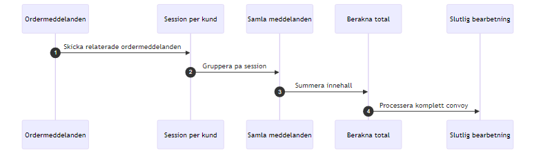

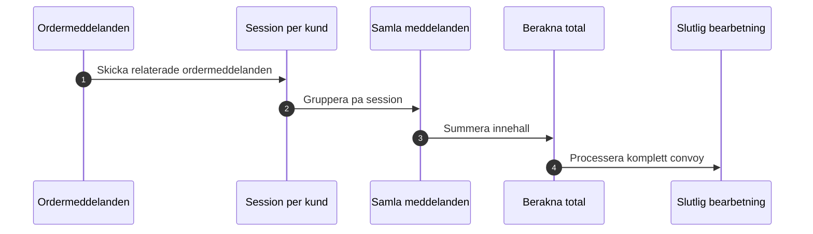
```mermaid
sequenceDiagram
    autonumber
    participant ORD as Ordermeddelanden
    participant SID as Session per kund
    participant COL as Samla meddelanden
    participant CALC as Berakna total
    participant PROC as Slutlig bearbetning

    ORD->>SID: Skicka relaterade ordermeddelanden
    SID->>COL: Gruppera pa session
    COL->>CALC: Summera innehall
    CALC->>PROC: Processera komplett convoy
```

### 28.0 Teknisk vy (Mermaid)

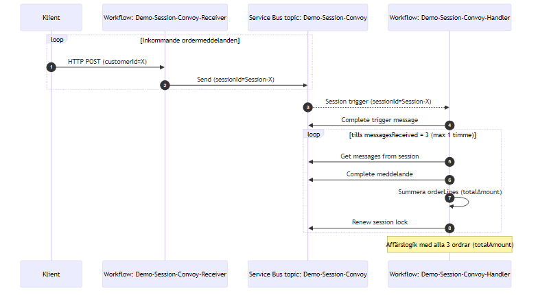

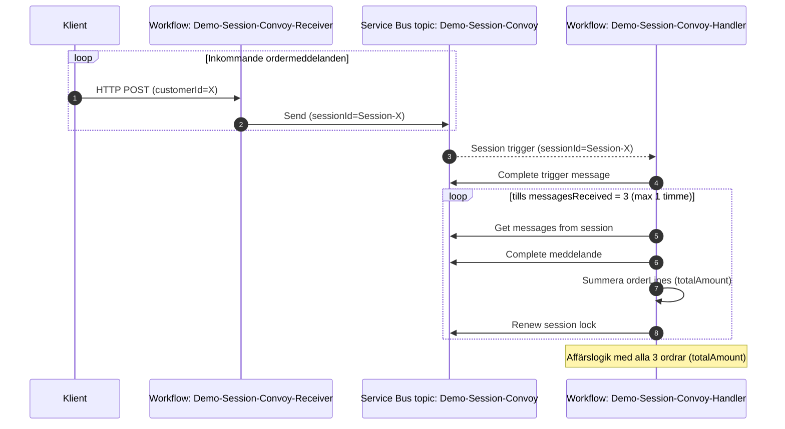
```mermaid
sequenceDiagram
    autonumber
    participant C as Klient
    participant RCV as Workflow: Demo-Session-Convoy-Receiver
    participant SB as Service Bus topic: Demo-Session-Convoy
    participant HND as Workflow: Demo-Session-Convoy-Handler

    loop Inkommande ordermeddelanden
        C->>RCV: HTTP POST (customerId=X)
        RCV->>SB: Send (sessionId=Session-X)
    end

    SB-->>HND: Session trigger (sessionId=Session-X)
    HND->>SB: Complete trigger message

    loop tills messagesReceived = 3 (max 1 timme)
        HND->>SB: Get messages from session
        HND->>SB: Complete meddelande
        HND->>HND: Summera orderLines (totalAmount)
        HND->>SB: Renew session lock
    end

    Note over HND: Affärslogik med alla 3 ordrar (totalAmount)
```

### 28.1 Flödeskarta

```
INKOMMANDE ORDRAR (en per HTTP-anrop)
Demo-Session-Convoy-Receiver (HTTP-triggrad via APIM)
│
├─ 1. Validera schema (Demo/Session-Convoy-Receiver.json)
├─ 2. Compose sessionId = "Session-{customerId}"
└─ 3. Send → SB topic: demo-session-convoy
       sessionId: "Session-{customerId}"
       contentData: order (med orderLines)
       CorrelationId: { InterchangeId, MessageId, CallerId }

(Skickas flera gånger med samma customerId – convoy-mönster)

        Service Bus: demo-session-convoy (topic, session-enabled)
        Subscription: Demo-Session-Convoy-Handler (requiresSession=true)
                │
                ▼
SAMLINGSHANTERING
Demo-Session-Convoy-Handler (SB session-triggrad, sessionId=Session-{customerId})
│
├─ Complete initial trigger message
├─ Until-loop: Vänta tills messagesReceived = 3 (max 60 iter / PT1H)
│    ├─ Get messages from session (max 1 per peek)
│    ├─ För varje hämtat meddelande:
│    │    ├─ LogicAppInitiatorTracker (med convoy-CorrelationId)
│    │    ├─ Compose order från contentData
│    │    ├─ Iterera orderLines: totalAmount += quantity × price
│    │    ├─ Increment messagesReceived
│    │    └─ Complete meddelande i session
│    └─ Om messagesReceived < 3:
│         └─ Renew session lock + Delay 30 sek
│
└─ (Alla 3 meddelanden mottagna – affärslogik med totalAmount)
```

### 28.2 Nyckelkoncept

- Sessions garanterar att alla orderrader för en kund hamnar hos **samma handler-instans**
- Hantering är ordnad och sekventiell inom sessionen
- Convoy-mönstret är idealiskt för t.ex. EDI-scenarier där en komplex transaktion består av header + flera detaljer skickade separat

---

## 29. End-to-end-flöde: schemavalidering

Schema-valideringsmönstret säkerställer att inkommande meddelanden uppfyller ett förväntat format innan affärslogiken körs.

### 29.E Executive vy (Mermaid)

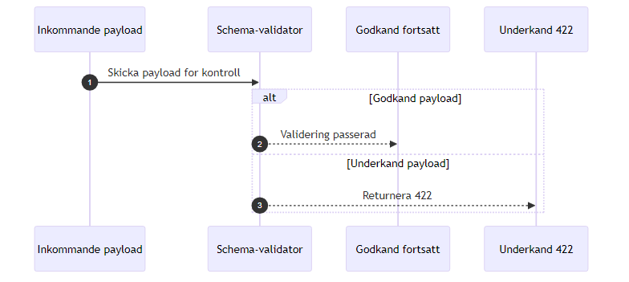

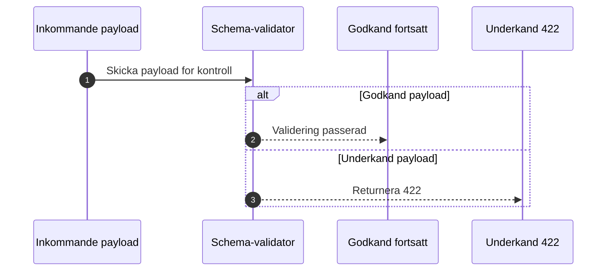
```mermaid
sequenceDiagram
    autonumber
    participant IN as Inkommande payload
    participant VAL as Schema-validator
    participant OK as Godkand fortsatt
    participant NOK as Underkand 422

    IN->>VAL: Skicka payload for kontroll
    alt Godkand payload
        VAL-->>OK: Validering passerad
    else Underkand payload
        VAL-->>NOK: Returnera 422
    end
```

### 29.0 Teknisk vy (Mermaid)

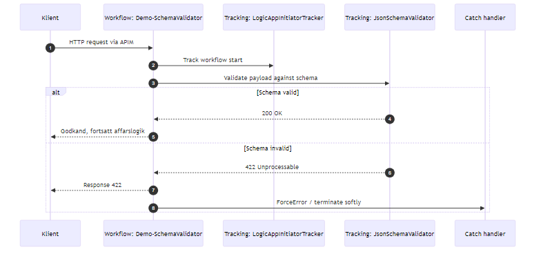

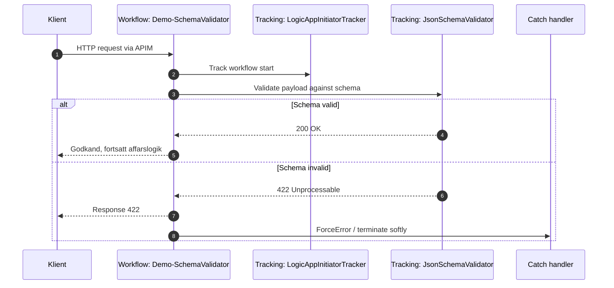
```mermaid
sequenceDiagram
    autonumber
    participant C as Klient
    participant WF as Workflow: Demo-SchemaValidator
    participant TRK as Tracking: LogicAppInitiatorTracker
    participant JSV as Tracking: JsonSchemaValidator
    participant ERR as Catch handler

    C->>WF: HTTP request via APIM
    WF->>TRK: Track workflow start
    WF->>JSV: Validate payload against schema
    alt Schema valid
        JSV-->>WF: 200 OK
        WF-->>C: Godkand, fortsatt affarslogik
    else Schema invalid
        JSV-->>WF: 422 Unprocessable
        WF-->>C: Response 422
        WF->>ERR: ForceError / terminate softly
    end
```

### 29.1 Flödeskarta (Demo-SchemaValidator och Demo-Session-*)

```
Inkommande HTTP-anrop (t.ex. APIM → Demo-SchemaValidator)
│
├─ LogicAppInitiatorTracker
└─ Schema_Validation (Scope):
     │
     └─ HTTP POST {APIMBaseURI}/tracking-func/JsonSchemaValidator
           body: {
             messageContent: @triggerBody(),
             schema: "Demo/Bookings.json"   ← JSON Schema-fil i Schema-storage
           }
           (MSI-auth mot APIM)
          │
          ├─ 200 OK: Validering godkänd → fortsätt affärslogik
          └─ 422 Unprocessable: Validering misslyckades:
               ├─ Response 422 till klienten
               ├─ Set schemaValidationError = true
               └─ ForceError → triggar Catch-blocket

Catch-blocket:
│
├─ Om schemaValidationError = true: Terminera tyst (klienten fick redan 422)
└─ Annars: Terminera med 500 + LogicAppErrorTracker
```

### 29.2 Schema-lagringsplats

JSON-schemas lagras i **Schema Storage Account** (INT-Storage). Tracking Function App exponerar `JsonSchemaValidator`-endpointen via APIM. Schemanamnet (t.ex. `Demo/Bookings.json`) refererar till en fil-sökväg i storage-kontot.

---

## 30. End-to-end-flöde: AI-driven beskrivningssammanfattning

Demo-AI-Description-Agent visar hur Logic Apps Standard kan använda Azure AI Foundry (Azure OpenAI) som en AI-agent med tool-calling för att bearbeta strukturerade affärsdata.

### 30.E Executive vy (Mermaid)

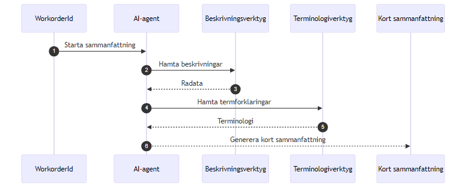

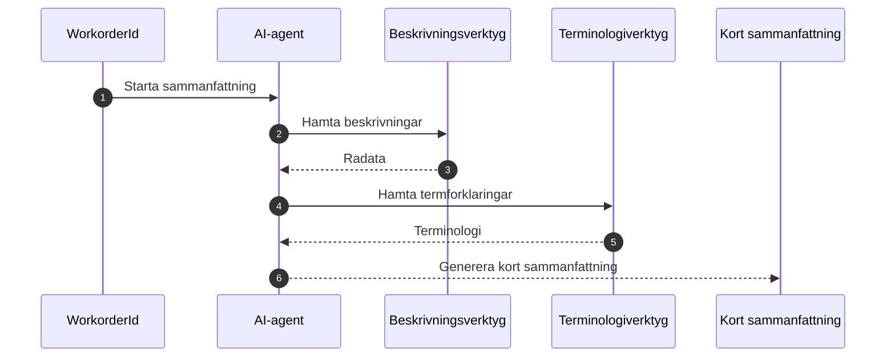
```mermaid
sequenceDiagram
    autonumber
    participant IN as WorkorderId
    participant AG as AI-agent
    participant DESC as Beskrivningsverktyg
    participant TERM as Terminologiverktyg
    participant OUT as Kort sammanfattning

    IN->>AG: Starta sammanfattning
    AG->>DESC: Hamta beskrivningar
    DESC-->>AG: Radata
    AG->>TERM: Hamta termforklaringar
    TERM-->>AG: Terminologi
    AG-->>OUT: Generera kort sammanfattning
```

### 30.0 Teknisk vy (Mermaid)

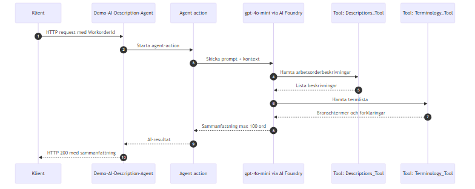

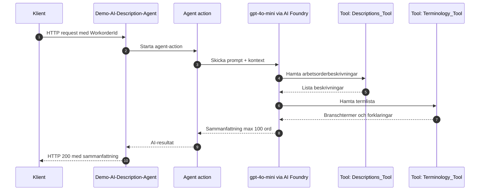
```mermaid
sequenceDiagram
    autonumber
    participant C as Klient
    participant WF as Demo-AI-Description-Agent
    participant ACT as Agent action
    participant GPT as gpt-4o-mini via AI Foundry
    participant DESC as Tool: Descriptions_Tool
    participant TERM as Tool: Terminology_Tool

    C->>WF: HTTP request med WorkorderId
    WF->>ACT: Starta agent-action
    ACT->>GPT: Skicka prompt + kontext
    GPT->>DESC: Hamta arbetsorderbeskrivningar
    DESC-->>GPT: Lista beskrivningar
    GPT->>TERM: Hamta termlista
    TERM-->>GPT: Branschtermer och forklaringar
    GPT-->>ACT: Sammanfattning max 100 ord
    ACT-->>WF: AI-resultat
    WF-->>C: HTTP 200 med sammanfattning
```

### 30.1 Flödeskarta

```
Inkommande HTTP-anrop: { WorkorderId: 2 }
        │
        ▼
Demo-AI-Description-Agent (INT-Demo-Logic, HTTP-triggrad via APIM)
│
└─ Agent-action (Logic Apps Standard AI Agent)
     model: gpt-4o-mini (via AI Foundry / Azure OpenAI)
     modelProvider: AzureOpenAI
     historyReduction: maximumTokenCount (max 128 000 tokens)
     │
     ├─ System-prompt:
     │    "Du är en AI-agent som sammanfattar arbetsorderbeskrivningar.
     │     Korrigera språkkvalitet, ta bort negativa uttalanden,
     │     max 100 ord, konvertera tekniska termer till klartext."
     │
     ├─ Tool: Descriptions_Tool
     │    └─ Filter Compose_Descriptions på WorkorderId
     │         Returnerar lista av workers' beskrivningar för ordern
     │
     └─ Tool: Terminology_Tool
          └─ Returnerar ordlista: AB, ABK, ABT, AFF, AMA, BIM, LOU,
               PBL, ÄTA, BAS P/U, osv.
               (branschspecifika termer med förklaringar)

AI-agenten:
1. Anropar Descriptions_Tool → hämtar råbeskrivningar
2. Anropar Terminology_Tool → förstår branschtermer
3. Genererar sammanfattning:
   - Professionellt språk, neutral ton
   - Max 100 ord
   - Interna termer utbytta mot klarspråk
4. Returnerar sammanfattningen som HTTP-svar
```

### 30.2 AI-integration via AI Foundry

- **AI Foundry-resursen** (INT-AI) tillhandahåller Azure OpenAI-endpointen
- **AI Foundry Project: IFlow** är workspace-kontexten
- Logic Apps Standard har native stöd för Agent-actions (Logic Apps AI-agentkoppling)
- Autentisering sker via MSI direkt mot AI Foundry-tjänsten

---

## 31. End-to-end-flöde: MCP tool-exponering via Logic Apps

Logic Apps Standard-workflows i INT-Demo-Logic exponeras som **MCP-verktyg (Model Context Protocol)** via APIM. Detta gör att AI-agenter (t.ex. Copilot, externa AI-system) kan anropa affärssystemets API:er som verktyg i ett agenturbaserat sammanhang.

### 31.E Executive vy (Mermaid)

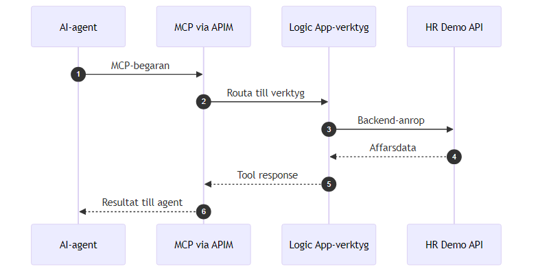

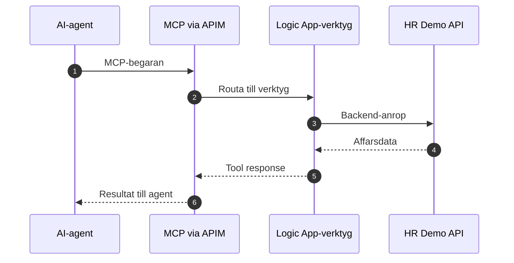
```mermaid
sequenceDiagram
    autonumber
    participant AI as AI-agent
    participant MCP as MCP via APIM
    participant TOOL as Logic App-verktyg
    participant API as HR Demo API

    AI->>MCP: MCP-begaran
    MCP->>TOOL: Routa till verktyg
    TOOL->>API: Backend-anrop
    API-->>TOOL: Affarsdata
    TOOL-->>MCP: Tool response
    MCP-->>AI: Resultat till agent
```

### 31.0 Teknisk vy (Mermaid)

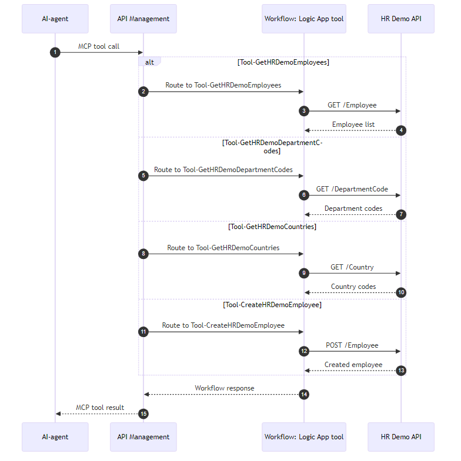

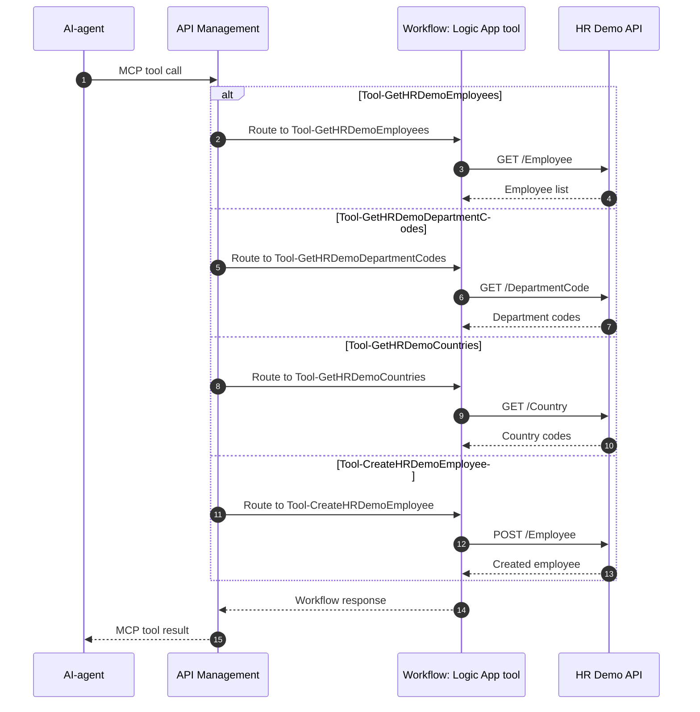
```mermaid
sequenceDiagram
    autonumber
    participant AG as AI-agent
    participant APIM as API Management
    participant TOOL as Workflow: Logic App tool
    participant API as HR Demo API

    AG->>APIM: MCP tool call
    alt Tool-GetHRDemoEmployees
        APIM->>TOOL: Route to Tool-GetHRDemoEmployees
        TOOL->>API: GET /Employee
        API-->>TOOL: Employee list
    else Tool-GetHRDemoDepartmentCodes
        APIM->>TOOL: Route to Tool-GetHRDemoDepartmentCodes
        TOOL->>API: GET /DepartmentCode
        API-->>TOOL: Department codes
    else Tool-GetHRDemoCountries
        APIM->>TOOL: Route to Tool-GetHRDemoCountries
        TOOL->>API: GET /Country
        API-->>TOOL: Country codes
    else Tool-CreateHRDemoEmployee
        APIM->>TOOL: Route to Tool-CreateHRDemoEmployee
        TOOL->>API: POST /Employee
        API-->>TOOL: Created employee
    end
    TOOL-->>APIM: Workflow response
    APIM-->>AG: MCP tool result
```

### 31.1 Exponerade MCP-verktyg

| Workflow | Tool-beskrivning | Backend-anrop |
|---|---|---|
| `Tool-GetHRDemoEmployees` | "Returns all employees from HR Demo" | GET /hrdemo/api/Employee |
| `Tool-GetHRDemoDepartmentCodes` | Returnerar avdelningskoder | GET /hrdemo/api/DepartmentCode |
| `Tool-GetHRDemoCountries` | Returnerar landkoder | GET /hrdemo/api/Country |
| `Tool-CreateHRDemoEmployee` | Skapar ny anställd | POST /hrdemo/api/Employee |

### 31.2 Flödeskarta

```
AI-agent (t.ex. Copilot)
        │
        │ MCP-protokollanrop (via APIM)
        ▼
Tool-GetHRDemoEmployees (INT-Demo-Logic, HTTP-triggrad)
│  trigger-description: "This tool will return all the employees from HR Demo"
│
├─ LogicAppInitiatorTracker
├─ HTTP GET {APIMBaseURI}/hrdemo/api/Employee
│    MSI-autentisering mot APIM
└─ Response 200 OK med employee-lista
```

### 31.3 MCP-arkitektur

MCP-exponeringen via Logic Apps gör det möjligt att:
- Alla befintliga Logic App-HTTP-endpoints kan bli AI-verktyg utan kodändring
- APIM genomför auth, rate-limiting och versionshantering
- Workflow-historiken i Logic Apps ger spårbarhet för alla AI-anrop
- Metadata (trigger-description) används av AI-agenten för att förstå vilket verktyg som ska användas

---

## 32. Deployordning och beroenden

Modulerna måste deployas i följande ordning för att beroenden ska vara uppfyllda:

```
1. INT-Network          (inget beroende)
2. INT-Monitoring       (beroende: INT-Network)
3. INT-Common           (inget beroende)
4. INT-KeyVault         (beroende: INT-Network, INT-Common)
5. INT-AuthConnectors   (inget beroende)
6. INT-Messaging        (beroende: INT-Monitoring)
7. INT-Storage          (beroende: INT-Network, INT-Common)
8. INT-Database         (beroende: INT-Network, INT-KeyVault)
9. INT-AI               (beroende: INT-Network, INT-Common)
10. INT-APIM            (beroende: INT-Monitoring, INT-Common, INT-KeyVault, INT-Network)
11. INT-Common-Functions-Isolated  (beroende: 1-10)
12. INT-Common-Logic    (beroende: 1-10)
13. INT-AppEvent-Logic  (beroende: 1-10)
14. INT-Demo-Logic      (beroende: 1-10, INT-AI)
15. INT-Demo / INT-Demo-HR  (beroende: 1-13)
16. INT-APIM APIs       (beroende: 10-15, Logic Apps & Functions måste finnas)
17. INT-APIM Subscriptions  (beroende: INT-APIM + APIs)
18. IFlow-Portal        (fristående parallell med 1-10)
```

---


